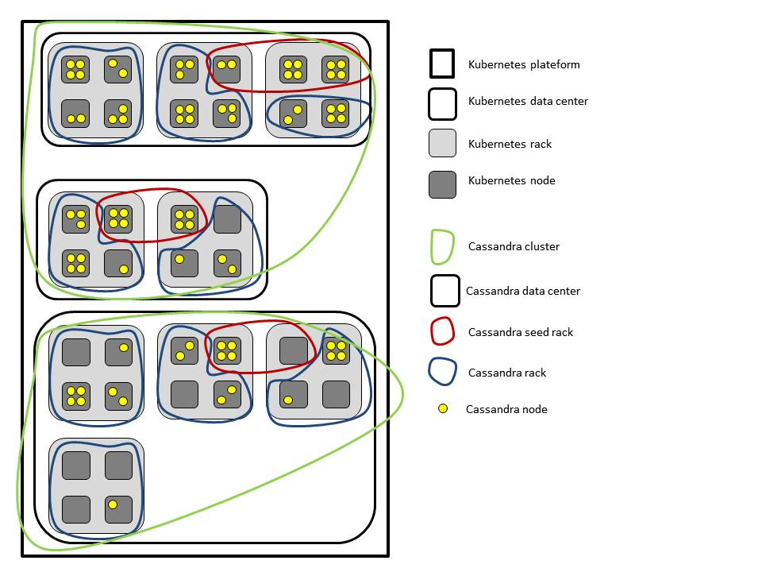

# Multi-cluster, multi-data center and multi-rack Cassandra cluster on a Kubernetes platform

## Index

- [Introduction](#introduction)
- [The idea](#the-idea)
- [TODO list](#todo-list)
- [Recommendations for developers](#recommendations-for-developers)
- [Requirements](#requirements)
- [Limitations](#limitations)
- [Manual](#manual)
  * [Semi-Automactic Mode: Steps to create a multi-data center, multi-rack Cassandra cluster on a Kubernetes platform](#semi-automactic-mode-steps-to-create-a-multi-data-center-multi-rack-cassandra-cluster-on-a-kubernetes-platform)
    + [Assign/Move/Unassign/Delete/Verify Kubernetes nodes to/from Cassandra cluster](#assignmoveunassigndeleteverify-kubernetes-nodes-tofrom-cassandra-cluster)
      - [Assign/Move nodes](#assignmove-nodes)
      - [Unassign/Delete nodes](#unassigndelete-nodes)
      - [Verify assigned nodes](#verify-assigned-nodes)
      - [Sum instances](#sum-instances)
    + [Create/Delete/Verify namespaces](#createdeleteverify-namespaces)
      - [Create namespaces](#create-namespaces)
      - [Delete namespaces](#delete-namespaces)
      - [Verify namepsaces](#verify-namepsaces)
    + [Create/Delete storage class](#createdelete-storage-class)
      - [Create storage class](#create-storage-class)
      - [Delete storage class](#delete-storage-class)
      - [Verify storage class](#verify-storage-class)
    + [Create/Delete persistent volumes](#createdelete-persistent-volumes)
      - [Create persistent volumes](#create-persistent-volumes)
      - [Delete persistent volumes](#delete-persistent-volumes)
      - [Verify persistent volumes](#verify-persistent-volumes)
      - [Dependencies with *kubeadm-dind-cluster*](#dependencies-with-kubeadm-dind-cluster)
    + [Create/Delete client services](#createdelete-client-services)
      - [Create client services](#create-client-services)
      - [Delete client services](#delete-client-services)
      - [Verify client services](#verify-client-services)
    + [Create/Delete headless services](#createdelete-headless-services)
      - [Create headless services](#create-headless-services)
      - [Delete headless services](#delete-headless-services)
      - [Verify headless services](#verify-headless-services)
    + [Create/Scale/Restart/Delete/Verify statefulSets](#createscalerestartdeleteverify-statefulsets)
      - [Create statefulSets](#create-statefulsets)
      - [Scale statefulSets](#scale-statefulsets)
      - [Restart statefulSets](#restart-statefulsets)
      - [Delete statefulSets](#delete-statefulsets)
      - [Verify statefulSets](#verify-statefulsets)
    + [Delete cluter/data center/rack](#delete-cluterdata-centerrack)
  * [Fully-Automatic Mode: Create/Add/Move Kubernetes nodes and Cassandra racks/data centers/clusters](#fully-automatic-mode-createaddmove-kubernetes-nodes-and-cassandra-racksdata-centersclusters)
    + [Examples](#examples)
      - [Create cluster](#create-cluster)
      - [Add/Move Kubernetes nodes](#addmove-kubernetes-nodes)
      - [Add data centers](#add-data-centers)
  * [nodetool](#nodetool)
- [Annexes](#annexes)
  * [kubeadm-dind-cluster](#kubeadm-dind-cluster)

## Introduction

The purpose of this work is to provide [*a set of shell scripts*](https://gitlab.forge.orange-labs.fr/tth/k8s/cassandra), to manage multiple [*Apache Cassandra*](http://cassandra.apache.org/) clusters which span multiple data centers and multiple racks over a [*Kubernetes*](https://kubernetes.io/) platform. In this document, you will learn how to use the script to manage this kind of Cassandra cluster.

To setup a multi-data center Cassandra cluster, we use the steps describe in the article [*10 steps to set up a multi-data center Cassandra cluster on a Kubernetes platform*](https://www.ibm.com/developerworks/library/ba-multi-data-center-cassandra-cluster-kubernetes-platform/index.html) by [*Rakesh Jain*](https://developer.ibm.com/author/rakeshj/). Obviously, our thanks go to *Rakesh Jain* for his article.

We use [*kubeadm-dind-cluster*](https://github.com/Mirantis/kubeadm-dind-cluster), a tool to create a Kubernetes multi-node cluster, based on [*kubeadm*](https://kubernetes.io/docs/setup/independent/create-cluster-kubeadm/) and *DIND* (*Docker-in-Docker*), to create our Kubernetes platforms. *kubeadm-dind-cluster* is very convenient to set the number of Kubernetes worker nodes. It requires some powerful resources (CPU,RAM,disk) if you create a large Kubernetes cluster. We provide in annexes, [kubeadm-dind-cluster](#kubeadm-dind-cluster) section, a short presentation of *kubeadm-dind-cluster*.

## The idea

We use Kubernetes [*labels*](https://kubernetes.io/docs/concepts/overview/working-with-objects/labels/) to assign a Kubernetes node to a Cassandra node in a rack in a data center in a cluster. For this, we create following labels for each Kubernetes assigned in a Cassandra cluster:

- `cassandra.cluster`, stands for the Cassandra cluster where the Kubernetes node is assigned,
- `cassandra.dataCenter`, stands for the Cassandra data center where the Kubernetes node is assigned,
- `cassandra.rack`, stands for the Cassandra rack where the Kubernetes node is assigned,
- `cassandra.instances`, stands for the maximum number of Cassandra instances (i.e.: Kubernetes [*pods*](https://kubernetes.io/docs/concepts/workloads/pods/pod/)) allowed on a Kubernetes node. We set this essentially because Kubernetes volume [*local*](https://kubernetes.io/docs/concepts/storage/volumes/#local) type does not support dynamic provisioner, yet. See [Create/Delete Storage Class](#createdelete-storage-class) section for details.

For example: We assigned Kubernetes node `kube-node-1` to Cassandra rack `seed` in data center `dataCenter-1` in cluster `cluster-1` with `5` maximum Cassandra instances allowed:

```shell
$ kubectl label nodes kube-node-1 --list
kubernetes.io/hostname=kube-node-1
beta.kubernetes.io/arch=amd64
beta.kubernetes.io/os=linux
cassandra.cluster=cluster-1
cassandra.dataCenter=dataCenter-1
cassandra.instances=5
cassandra.rack=seed
```

**Note**: As Kubernetes nodes don't support [*namespaces*](https://kubernetes.io/docs/concepts/overview/working-with-objects/namespaces/), a Kubernetes node can be assigned only in an unique rack in an unique data center in an unique cluster with an unique number of instances.

**Note**: To see which Kubernetes resources are and aren’t in a namespace:

```shell
# In a namespace
$ kubectl api-resources --namespaced=true

# Not in a namespace
$ kubectl api-resources --namespaced=false
```

We create a [*statefulSet*](https://kubernetes.io/docs/concepts/workloads/controllers/statefulset/) for each rack. *StatefulSet* have previous labels too, except the number of Cassandra instances: a *statefulSet* is assigned to rack in a data center in a cluster. [*Pods*](https://kubernetes.io/docs/concepts/workloads/pods/pod-overview/) in *statefulSet* has [*node affinity*](https://kubernetes.io/docs/concepts/configuration/assign-pod-node/) defined such that *pods* are deployed only on Kubernetes nodes where previous *labels* on nodes are equal with labels on *statefulSet*. Here is an excerpt of the *statefulSet* template we use:

```yaml
# StatefulSet for Pods in rack <rack> in data center
# <dataCenter> in cluster <cluster>
apiVersion: apps/v1
kind: StatefulSet
metadata:
  name: <clusterDNS>-<dataCenterDNS>-<rackDNS>
  labels:
    app: cassandra
    cassandra.cluster: <cluster>
    cassandra.dataCenter: <dataCenter>
    cassandra.rack: <rack>
spec:
  serviceName: <clusterDNS>-<dataCenterDNS>
  ...
  selector:
    matchLabels:
      app: cassandra
      cassandra.cluster: <cluster>
      cassandra.dataCenter: <dataCenter>
      cassandra.rack: <rack>
  ...
  template:
    metadata:
      labels:
        app: cassandra
        cassandra.cluster: <cluster>
        cassandra.dataCenter: <dataCenter>
        cassandra.rack: <rack>
    spec:
      affinity:
        # To schedule a Pod on a Kubernes node with label
        # cassandra.cluster and
        # cassandra.dataCenter and
        # cassandra.rack
        nodeAffinity:
          requiredDuringSchedulingIgnoredDuringExecution:
            nodeSelectorTerms:
            - matchExpressions:
              - key: cassandra.cluster
                operator: In
                values:
                - <cluster>
              - key: cassandra.dataCenter
                operator: In
                values:
                - <dataCenter>
              - key: cassandra.rack
                operator: In
                values:
                - <rack>
  ...
```

The complete *statefulSet* template configuration is in the file [`yaml/statefuSet.cluster.dataCenter.rack.yaml.template`](yaml/statefulSet.cluster.dataCenter.rack.yaml.template).

**Note**: The name of a *statefulSet* is `clusterDNS-dataCenterDNS-rackDNS` and it's associated [*headless service*](https://kubernetes.io/docs/concepts/services-networking/service/#headless-services) is `clusterDNS-dataCenterDNS`. Where `clusterDNS`, `dataCenterDNS` and `rackDNS` are respectively the name of a cluster, a data center and a rack in lower case because Kubernetes DNS don't support upper case. For example, the name of the *statefulSet* associated with a rack `seed` in a data center `dataCenter-1` in a cluster `cluster-1` is `cluster-1-datacenter-1-seed` and the name of its associated *headless service* is `cluster-1-datacenter-1`. We'll see below how we defined *headless service*.

In our Cassandra cluster, for each data center, we assign a dedicated rack, which name is set by the global variable `SEED_RACK` (its default value is `seed`), for Cassandra [*seed*](http://cassandra.apache.org/doc/latest/faq/#what-are-seeds) nodes, but not only. As a rack is associated with a *statefulSet*, we know all seeds *pods* DNS names in a cluster if we know all data centers names and the greatest number of seeds *pods*. The maximum number of seed nodes in a seed rack (i.e.: the maximum number of pods allowed to act as Cassandra seeds in a *statefulSet*) is set by the global variable `MAX_SEED`, with `3` as the default value. We allow *pods* with index in range `[0,MAX_SEED[` to act as Cassandra seeds. If the number of replicas `replicas` of the *statefulSet* associated with a `seed` rack is greater than `MAX_SEED` then *pods* with index in range `[MAX_SEED-1,replicas[` are not Cassandra seeds. With this knowledge, we can populate `CASSANDRA_SEEDS` environment variable in *statefulSet* with DNS names of *pods* acting as Cassandra seeds in all data centers in a cluster. We make this choice to avoid dependencies with container image (e.g.: codes for *SeedProvider*, scripts to populate `CASSANDRA_SEED` environment variable, etc.). We made this choice also to simply adding or removing data centers in a Cassandra cluster: knowing data centers names in a Cassandra cluster, we can update `CASSANDRA_SEED` environment variable in *statefulSet* then make a [*rolling update*](https://kubernetes.io/docs/concepts/workloads/controllers/statefulset/#update-strategies) on *statefulSet* to use the updated value of `CASSANDRA_SEED`. **Note**: Cassandra documents recommend to define more than 2 seeds per data center.

>[**Attention**: Making every node a seed node is not recommended because of increased maintenance and reduced gossip performance. Gossip optimization is not critical, but it is recommended to use a small seed list (approximately three nodes per datacenter).](https://docs.datastax.com/en/dse/6.0/dse-admin/datastax_enterprise/operations/opsReplaceNode.html)

Following figure is the kind of topology promoted by our program:


**Note**: Kubernetes use the concept of *topology domain*: it could be

>[node, rack, cloud provider zone, cloud provider region, etc. You express it using a **topologyKey** which is the key for the node label that the system uses to denote such a topology domain, e.g. see the label keys listed above in the section *Interlude: built-in node labels*](https://kubernetes.io/docs/concepts/configuration/assign-pod-node/)

## TODO list

- [*Cassandra backup and restore*](https://docs.datastax.com/en/dse/6.0/dse-admin/datastax_enterprise/operations/opsBackupRestoreTOC.html) are not implemented.
- Use [*ingress*](https://kubernetes.io/docs/concepts/services-networking/ingress/) to allow external access to [client service](#createdelete-client-services) in a Cassandra cluster.
- Use [*Kubernetes ConfigMap*](https://kubernetes.io/docs/tasks/configure-pod-container/configure-pod-configmap/) feature to improve Cassandra's configuration.

## Recommendations for developers

- Use list instead item by item in the list to request with `kubectl`. For example, use:

```shell
$ cat ~/tmp/test1.sh
list="$(kubectl get nodes kube-node-1 kube-node-2 kube-node-3 2>/dev/null)"
for node in $(printf "%s\n" "${list}" | awk '{if($1!="NAME") print $1}');
do
  printf "%s\n" "${node}";
done
```

instead:

```shell
$ cat ~/tmp/test2.sh
list="kube-node-1 kube-node-2 kube-node-3"
for node in ${list};
do
  kubectl get nodes ${node} | awk 'NR>1{print $1}'
done
```

because `test1.sh` is much more faster than `test2.sh`:

```shell
$ time ~/tmp/test1.sh
kube-node-1
kube-node-2
kube-node-3

real  0m0.195s
user  0m0.128s
sys 0m0.056s
```

and

```shell
$ time ~/tmp/test2.sh
kube-node-1
kube-node-2
kube-node-3

real  0m0.329s
user  0m0.336s
sys 0m0.080s
```

But `kubectl` have a limitation: it stop at the first error. For example:

```shell
$ kubectl get nodes kube-node-1 toto kube-node-2 kube-node-3
NAME          STATUS    ROLES     AGE       VERSION
kube-node-1   Ready     <none>    36m       v1.11.0
Error from server (NotFound): nodes "toto" not found
```

So you can't always submit a list to `kubectl` if you don't want this behavior.

**Note**: With a secure Kubernetes cluster, with authentication, for example, impacts on performance could be dramatic if we can't request a list with `kubectl`.

- For portability, between Kubernetes versions, use `-o=custom-columns=...` to format your output instead default `kubectl` output because `kubectl` default output has no specification. Section [*Formatting output*](https://kubernetes.io/docs/reference/kubectl/overview/#output-options) explains how to use *custom columns* feature.

**Note**: As *custom columns* feature uses JSON paths, you can use `-o json` with `kubectl` to see available Kubernetes objects JSON paths.

## Requirements

- Linux,
- Kubernetes 1.9 or higher,
- [*Docker*](https://www.docker.com/community-edition) 1.12 or higher,
- kubeadm-dind-cluster. We have a dependency with this tool: kubeadm-dind-cluster don't provide [*OpenSSH*](https://www.openssh.com/) access to Kubernetes worker, we have to use `docker exec` command. This dependency occurs only for [*persistent volumes*](https://kubernetes.io/docs/concepts/storage/persistent-volumes/) management. See [Dependencies with *kubeadm-dind-cluster*](#dependencies-with-kubeadm-dind-cluster) section below for details.
- [*GNU Bash*](https://www.gnu.org/software/bash/) 3.0 or higher,
- [*GNU sed*](https://www.gnu.org/software/sed/),
- [*GNU awk*](https://www.gnu.org/software/gawk/).

Our scripts were developed and tested with:

- Ubuntu 16.04.4 LTS,
- Kubernetes 1.10.3 and 1.11.0
- Docker 18.03.1-ce,
- kubeadm-dind-cluster at master branch,
- GNU Bash 4.3.48,
- GNU sed 4.2.2,
- GNU awk 4.1.3,
- [*ShellCheck - shell script analysis tool*](http://www.shellcheck.net) 0.3.7.

**Note**: [`kubectl`](https://kubernetes.io/docs/reference/kubectl/overview/), [`docker`](https://docs.docker.com/engine/reference/commandline/docker/#child-commands), `sed`, `awk` commands should be available by your `PATH` variable environment.

## Limitations

- [*Kubernetes federation*](https://kubernetes.io/docs/concepts/cluster-administration/federation/) is not supported.

## Manual

The main entry of our program is [`script/operator.sh`](script/operator.sh). The program supports two modes:

- [*semi-automatic*](#semi-automactic-mode-steps-to-create-a-multi-data-center-multi-rack-cassandra-cluster-on-a-kubernetes-platform),
- [*fully-automatic*](#fully-automatic-mode-createaddmove-kubernetes-nodes-and-cassandra-racksdata-centersclusters).

To describe how our program works, in the following, we use the semi-automatic mode to create step by step a multi-data center, multi-rack Cassandra cluster.
Of course, the main purpose of our works is to provide the fully-automatic mode.

### Semi-Automactic Mode: Steps to create a multi-data center, multi-rack Cassandra cluster on a Kubernetes platform

#### Assign/Move/Unassign/Delete/Verify Kubernetes nodes to/from Cassandra cluster

##### Assign/Move nodes

Get available Kubernetes nodes with the command `kubectl get nodes`:

```shell
$ kubectl get nodes
NAME          STATUS    ROLES     AGE       VERSION
kube-master   Ready     master    23h       v1.11.0
kube-node-1   Ready     <none>    23h       v1.11.0
kube-node-2   Ready     <none>    23h       v1.11.0
kube-node-3   Ready     <none>    23h       v1.11.0
kube-node-4   Ready     <none>    23h       v1.11.0
kube-node-5   Ready     <none>    23h       v1.11.0
kube-node-6   Ready     <none>    23h       v1.11.0
kube-node-7   Ready     <none>    23h       v1.11.0
kube-node-8   Ready     <none>    23h       v1.11.0
```

To assign available Kubernetes nodes to Cassandra nodes by labeling them, use the command:

```shell
$ script/operator.sh
  create|c
    nodelabel|nl <cluster> <data center> <rack> <instances> [-ow] <list of Kubernetes node>
```

Where:

- `cluster` is a Cassandra's cluster name,
- `data center` is a data center in the previous cluster,
- `rack` is a rack in the previous data center,
- `instances` is the maximum number of Cassandra instances allowed on each node in the previous rack,
- `list of Kubernetes node` is a list of Kubernetes node to assign as Cassandra's nodes in the previous rack. Items where error occurred are displayed on the standard output.
- `-ow` is an optional flag for overwriting previously successful assignments.

Assigning has following behaviors:

- An error occur if in `list of Kubernetes node` parameter:
  - A string is not a Kubernetes node,
  - A Kubernetes node is already assigned in a Cassandra cluster with another `cluster` or `data center` or `rack` or `instances` values. You can overcome this behavior if your assignment use the overwrite flag `-ow` and the assignment is equal to move a Kubernetes node in another cluster or data center or rack. If pods or persistent volumes are present on the moving Kubernetes node, they are deleted. In semi-automatic mode, you need to create first persistent volumes and then scale up or create statefulSet to take in account the Kubernetes node move.
  **Note**: Modifying `instances` should not equal a moving operation if you scale up `instances`. This should be improve in a next version.
- If A Kubernetes node is already assigned in a Cassandra cluster with equal `cluster` and `data center` and `rack` and `instances` values, the result is equal a nope operation.
- The command returns in standard output strings in `list of Kubernetes node` where an error occurred.

**Note**: We use the following convention:

- Arguments between `<` and `>` are mandatory.
- Arguments between `[` and `]` are optional.
- You must respect arguments order.
- Errors, warnings and debugs messages are displayed on the standard error and items where errors occurred are also displayed on the standard output.

Some assignments examples:

- The command:

```shell
$ script/operator.sh c nl cluster-1 dataCenter-1 seed 3 kube-node-1 kube-node-2 kube-node-3
```

prompts:

```shell
DEBUG: createNodeLabel: kubectl:
node/kube-node-1 labeled
DEBUG: createNodeLabel: kubectl:
node/kube-node-2 labeled
DEBUG: createNodeLabel: kubectl:
node/kube-node-3 labeled
```

The previous command assigned Kubernetes nodes `kube-node-1`, `kube-node-2` and `kube-node-3` to rack `seed` in data center `dataCenter-1` in cluster `cluster-1` and set the maximum number of *pods* (i.e.: Cassandra instances) allowed on each Kubernetes node to `3`.

You can verify the result with the command:

```shell
$ kubectl get nodes kube-node-1 kube-node-2 kube-node-3 --show-labels
NAME          STATUS    ROLES     AGE       VERSION   LABELS
kube-node-1   Ready     <none>    8h        v1.11.0   beta.kubernetes.io/arch=amd64,beta.kubernetes.io/os=linux,cassandra.cluster=cluster-1,cassandra.dataCenter=dataCenter-1,cassandra.instances=3,cassandra.rack=seed,kubernetes.io/hostname=kube-node-1
NAME          STATUS    ROLES     AGE       VERSION   LABELS
kube-node-2   Ready     <none>    8h        v1.11.0   beta.kubernetes.io/arch=amd64,beta.kubernetes.io/os=linux,cassandra.cluster=cluster-1,cassandra.dataCenter=dataCenter-1,cassandra.instances=3,cassandra.rack=seed,kubernetes.io/hostname=kube-node-2
NAME          STATUS    ROLES     AGE       VERSION   LABELS
kube-node-3   Ready     <none>    8h        v1.11.0   beta.kubernetes.io/arch=amd64,beta.kubernetes.io/os=linux,cassandra.cluster=cluster-1,cassandra.dataCenter=dataCenter-1,cassandra.instances=3,cassandra.rack=seed,kubernetes.io/hostname=kube-node-3
```

- The command:

```shell
$ script/operator.sh c nl cluster-1 dataCenter-1 seed 2 toto kube-node-1 tata
```

where items `toto` and `tata` are not Kubernetes nodes and kube-node-1 is an already assigned Kubernetes node, prompts on standard output and standard error:

```shell
ERROR: compareNodeLabel: kubectl:
Error from server (NotFound): nodes "toto" not found
toto
ERROR: compareNodeLabel: kubectl:
Error from server (NotFound): nodes "tata" not found
tata
kube-node-1
ERROR: createNodeLabel: kubectl:
'cassandra.instances' already has a value (3), and --overwrite is false
'cassandra.cluster' already has a value (cluster-1), and --overwrite is false
'cassandra.dataCenter' already has a value (dataCenter-1), and --overwrite is false
'cassandra.rack' already has a value (seed), and --overwrite is false
```

If we redirect the standard error in `/dev/null`, the previous command displays on standard output:

```shell
$ script/operator.sh c nl cluster-1 dataCenter-1 seed 2 toto kube-node-1 tata 2>/dev/null
toto
tata
kube-node-1
```

- The command:

```shell
$ script/operator.sh c nl cluster-1 dataCenter-1 rack-1 2 kube-node-1
```

prompts:

```shell
ERROR: createNodeLabel: You can't create labels on node "kube-node-1" because following pods:
cluster-1-datacenter-1-seed-1
cluster-1-datacenter-1-seed-5
cluster-1-datacenter-1-seed-7
are running on it
ERROR: createNodeLabel: You can't create labels on node "kube-node-1" because following persistent volumes:
cluster-1-datacenter-1-seed-kube-node-1-0
cluster-1-datacenter-1-seed-kube-node-1-1
cluster-1-datacenter-1-seed-kube-node-1-2
remain on it
ERROR: createNodeLabel: To create node labels, you must first delete corresponding statefulSets and/or persistent volumes, or delete the node, or use the -ow option to create node labels
kube-node-1
```

because `kube-node-1` is an already assigned Kubernetes node and persistent volumes and pods are created on it, so the requested assignment failed. We can overcome this behavior by adding the optional overwrite flag `-ow` in the previous command:

```shell
$ script/operator.sh c nl cluster-1 dataCenter-1 rack-1 2 -ow kube-node-1
```

prompts:

```shell
DEBUG: deleteNode: Decommissioning all pods in rack "cluster-1.dataCenter-1.seed"...
DEBUG: deleteStatefulSet: Deleting statefulSet "cluster-1-datacenter-1-seed"...
DEBUG: deleteStatefulSet: kubectl:
statefulset.apps "cluster-1-datacenter-1-seed" deleted
DEBUG: releasePersistentVolumeClaim: kubectl:
persistentvolumeclaim "local-data-cluster-1-datacenter-1-seed-0" deleted
DEBUG: releasePersistentVolumeClaim: kubectl:
persistentvolume "cluster-1-datacenter-1-seed-kube-node-3-0" deleted
DEBUG: boundInstancePersistentVolume: kubectl:
persistentvolume/cluster-1-datacenter-1-seed-kube-node-3-0 created
DEBUG: releasePersistentVolumeClaim: kubectl:
persistentvolumeclaim "local-data-cluster-1-datacenter-1-seed-1" deleted
DEBUG: releasePersistentVolumeClaim: kubectl:
persistentvolume "cluster-1-datacenter-1-seed-kube-node-1-0" deleted
DEBUG: boundInstancePersistentVolume: kubectl:
persistentvolume/cluster-1-datacenter-1-seed-kube-node-1-0 created
DEBUG: releasePersistentVolumeClaim: kubectl:
persistentvolumeclaim "local-data-cluster-1-datacenter-1-seed-2" deleted
DEBUG: releasePersistentVolumeClaim: kubectl:
persistentvolume "cluster-1-datacenter-1-seed-kube-node-2-1" deleted
DEBUG: boundInstancePersistentVolume: kubectl:
persistentvolume/cluster-1-datacenter-1-seed-kube-node-2-1 created
DEBUG: releasePersistentVolumeClaim: kubectl:
persistentvolumeclaim "local-data-cluster-1-datacenter-1-seed-3" deleted
DEBUG: releasePersistentVolumeClaim: kubectl:
persistentvolume "cluster-1-datacenter-1-seed-kube-node-3-1" deleted
DEBUG: boundInstancePersistentVolume: kubectl:
persistentvolume/cluster-1-datacenter-1-seed-kube-node-3-1 created
DEBUG: releasePersistentVolumeClaim: kubectl:
persistentvolumeclaim "local-data-cluster-1-datacenter-1-seed-4" deleted
DEBUG: releasePersistentVolumeClaim: kubectl:
persistentvolume "cluster-1-datacenter-1-seed-kube-node-2-0" deleted
DEBUG: boundInstancePersistentVolume: kubectl:
persistentvolume/cluster-1-datacenter-1-seed-kube-node-2-0 created
DEBUG: releasePersistentVolumeClaim: kubectl:
persistentvolumeclaim "local-data-cluster-1-datacenter-1-seed-5" deleted
DEBUG: releasePersistentVolumeClaim: kubectl:
persistentvolume "cluster-1-datacenter-1-seed-kube-node-1-1" deleted
DEBUG: boundInstancePersistentVolume: kubectl:
persistentvolume/cluster-1-datacenter-1-seed-kube-node-1-1 created
DEBUG: releasePersistentVolumeClaim: kubectl:
persistentvolumeclaim "local-data-cluster-1-datacenter-1-seed-6" deleted
DEBUG: releasePersistentVolumeClaim: kubectl:
persistentvolume "cluster-1-datacenter-1-seed-kube-node-3-2" deleted
DEBUG: boundInstancePersistentVolume: kubectl:
persistentvolume/cluster-1-datacenter-1-seed-kube-node-3-2 created
DEBUG: releasePersistentVolumeClaim: kubectl:
persistentvolumeclaim "local-data-cluster-1-datacenter-1-seed-7" deleted
DEBUG: releasePersistentVolumeClaim: kubectl:
persistentvolume "cluster-1-datacenter-1-seed-kube-node-1-2" deleted
DEBUG: boundInstancePersistentVolume: kubectl:
persistentvolume/cluster-1-datacenter-1-seed-kube-node-1-2 created
DEBUG: releasePersistentVolumeClaim: kubectl:
persistentvolumeclaim "local-data-cluster-1-datacenter-1-seed-8" deleted
DEBUG: releasePersistentVolumeClaim: kubectl:
persistentvolume "cluster-1-datacenter-1-seed-kube-node-2-2" deleted
DEBUG: boundInstancePersistentVolume: kubectl:
persistentvolume/cluster-1-datacenter-1-seed-kube-node-2-2 created
DEBUG: deleteNode: ...All pods in rack "cluster-1.dataCenter-1.seed" were decommissioned
DEBUG: releaseNodePersistentVolume: kubectl:
persistentvolume "cluster-1-datacenter-1-seed-kube-node-1-0" deleted
DEBUG: releaseNodePersistentVolume: kubectl:
persistentvolume "cluster-1-datacenter-1-seed-kube-node-1-1" deleted
DEBUG: releaseNodePersistentVolume: kubectl:
persistentvolume "cluster-1-datacenter-1-seed-kube-node-1-2" deleted
DEBUG: deleteNodeLabel: kubectl:
node/kube-node-1 labeled
WARN: deleteNode: Not enough instances in rack "cluster-1.dataCenter-1.seed": desired replicas: "9", available instances: "6"
WARN: deleteNode: Scale down desired replicas to available instances (6)
DEBUG: deleteNode: Creating statefulSet "cluster-1-datacenter-1-seed"
DEBUG: createStatefulSet: kubectl:
statefulset.apps/cluster-1-datacenter-1-seed created
DEBUG: waitUntilRunning: Waiting for Pods...
DEBUG: waitUntilRunning: 0/6 pods in rack "cluster-1.dataCenter-1.seed" are in running state.
DEBUG: waitUntilRunning: 1/6 pods in rack "cluster-1.dataCenter-1.seed" are in running state.
...
DEBUG: waitUntilRunning: 2/6 pods in rack "cluster-1.dataCenter-1.seed" are in running state.
DEBUG: waitUntilRunning: 3/6 pods in rack "cluster-1.dataCenter-1.seed" are in running state.
...
DEBUG: waitUntilRunning: 4/6 pods in rack "cluster-1.dataCenter-1.seed" are in running state.
DEBUG: waitUntilRunning: 5/6 pods in rack "cluster-1.dataCenter-1.seed" are in running state.
DEBUG: waitUntilRunning: All pods (6) in rack "cluster-1.dataCenter-1.seed" are in running state.
DEBUG: createNodeLabel: kubectl:
node/kube-node-1 labeled
```

As `kube-node-1` is assigned to rack `seed` in data center `dataCenter-1` in cluster `cluster-1`, following steps are applied:
- delete the statefulSet associated with the rack `seed` by decommissioning Cassandra's nodes in the rack,
- delete [*persistent volumes claims*](https://kubernetes.io/docs/concepts/storage/persistent-volumes/#lifecycle-of-a-volume-and-claim) and their binded persistent volume, but we don't delete persistent volume's storage, then create again deleted persistent volumes
- delete persistent volumes and their storage for `kube-node-1`,
- unassign `kube-node-1`,
- create again the statefulSet associated with the rack `seed` but now without `kube-node-1`: this is equal a [*statefulSet scale down*](https://kubernetes.io/docs/tasks/run-application/scale-stateful-set/). For instance, the statefulSet's replicas, with `kube-node-1`, was 6, drops, without `kube-node-1`, to 4,
- assign `kube-node-1` to rack `rack-1` in data center `dataCenter-1` in cluster `cluster-1`.

**Note**: As statefulSet's pods are ordered (see [*Pod Identity*](https://kubernetes.io/docs/concepts/workloads/controllers/statefulset/#pod-identity)), and we can't assume how Kubernetes scheduler worked, when we unassign a Kubernetes node, we have to delete an entire statefulSet.

**Note**: We can't [*drain*](http://cassandra.apache.org/doc/latest/tools/nodetool/drain.html) a Cassandra node when we delete it's associated pod because the drained Cassandra node remains in its joined Cassandra cluster with `down` status if used `IP` by the deleted pod is not reused. So we decommission Cassandra nodes when we delete their associated pods, as we can't assume that Kubernetes will use previous `IP`.

**Note**: The new assignment of `kube-node-1`, in semi-automatic mode don't create neither persistent volumes nor statefulSet to take in account the new assignment. We need create persistent volumes and statefulSet with commands describe below.

##### Unassign/Delete nodes

To unassign labels on Kubernetes nodes, use the command:

```shell
$ script/operator.sh
  delete|d
    nodelabel|nl
      clusterlist|cl [--force] [-cl <list of cluster>] [-dc <list of data center>] [-rk <list of rack>]
      nodelist|nl [--force] <list of Kubernetes node>
```

Where:

- `list of cluster` is a list of cluster,
- `list of data center` is a list of data center in the previous list of cluster,
- `list of rack` is a list of rack in the previous list of data center,
- `list of Kubernetes node` is a list of Kubernetes node.
- `--force` is an optional flag to use if you want to unassign a Kubernetes node where Cassandra pods or persistent volumes exist otherwise the unassignment fails. This option set, existing Cassandra pods or persistent volumes are deleted.

The command returns in standard output strings in `list of Kubernetes node` where an error occurred.

If items in one of the previous list are not what they claimed, the command display errors messages for these items on the standard error and items where errors occurred are displayed on the standard output.

For examples:

- To unassign labels on previously assigned Kubernetes nodes `kube-node-1`, `kube-node-2` and `kube-node-3`:

```shell
$ script/operator.sh d nl nl kube-node-8 kube-node-2 kube-node-3
```

prompts:

```shell
DEBUG: deleteNodeLabel: kubectl:
node/kube-node-3 labeled
DEBUG: deleteNodeLabel: kubectl:
node/kube-node-2 labeled
DEBUG: deleteNodeLabel: kubectl:
node/kube-node-1 labeled
```

- The command

```shell
$ script/operator.sh d nl nl toto kube-node-1 tata
```

where `toto` and `tata` are not Kubernetes nodes and `kube-node-1` is an previously assigned Kubernetes node prompts on standard output and standard error:

```shell
ERROR: isCassandraNode: kubectl:
Error from server (NotFound): nodes "toto" not found
ERROR: deleteNodeLabel: Node "toto" is not a Cassandra node
toto
ERROR: isCassandraNode: kubectl:
Error from server (NotFound): nodes "tata" not found
ERROR: deleteNodeLabel: Node "tata" is not a Cassandra node
tata
DEBUG: deleteNodeLabel: kubectl:
node/kube-node-1 labeled
```

- The command

```shell
$ script/operator.sh d nl nl kube-node-2
```

prompts:

```shell
ERROR: deleteNodeLabel: You can't create labels on node "kube-node-2" because following pods:
cluster-1-datacenter-1-seed-1
cluster-1-datacenter-1-seed-3
cluster-1-datacenter-1-seed-5
are running on it
ERROR: deleteNodeLabel: You can't create labels on node "kube-node-2" because following persistent volumes:
cluster-1-datacenter-1-seed-kube-node-2-0
cluster-1-datacenter-1-seed-kube-node-2-1
cluster-1-datacenter-1-seed-kube-node-2-2
remain on it
ERROR: deleteNodeLabel: To delete node labels, you must first delete corresponding statefulSets and/or persistent volumes, or delete the node, or use the --force option to delete node labels
kube-node-2
```

because `kube-node-2` have pods and persistent volumes, and the unassignment failed. To overcome this behavior, we add the optional flag `--force` in the previous command:

```shell
$ script/operator.sh d nl nl --force kube-node-2
```

prompts:

```shell
DEBUG: deleteNode: Decommissioning all pods in rack "cluster-1.dataCenter-1.seed"...
DEBUG: deleteStatefulSet: Deleting statefulSet "cluster-1-datacenter-1-seed"...
DEBUG: deleteStatefulSet: kubectl:
statefulset.apps "cluster-1-datacenter-1-seed" deleted
DEBUG: releasePersistentVolumeClaim: kubectl:
persistentvolumeclaim "local-data-cluster-1-datacenter-1-seed-0" deleted
DEBUG: releasePersistentVolumeClaim: kubectl:
persistentvolume "cluster-1-datacenter-1-seed-kube-node-3-0" deleted
DEBUG: boundInstancePersistentVolume: kubectl:
persistentvolume/cluster-1-datacenter-1-seed-kube-node-3-0 created
DEBUG: releasePersistentVolumeClaim: kubectl:
persistentvolumeclaim "local-data-cluster-1-datacenter-1-seed-1" deleted
DEBUG: releasePersistentVolumeClaim: kubectl:
persistentvolume "cluster-1-datacenter-1-seed-kube-node-2-0" deleted
DEBUG: boundInstancePersistentVolume: kubectl:
persistentvolume/cluster-1-datacenter-1-seed-kube-node-2-0 created
DEBUG: releasePersistentVolumeClaim: kubectl:
persistentvolumeclaim "local-data-cluster-1-datacenter-1-seed-2" deleted
DEBUG: releasePersistentVolumeClaim: kubectl:
persistentvolume "cluster-1-datacenter-1-seed-kube-node-3-1" deleted
DEBUG: boundInstancePersistentVolume: kubectl:
persistentvolume/cluster-1-datacenter-1-seed-kube-node-3-1 created
DEBUG: releasePersistentVolumeClaim: kubectl:
persistentvolumeclaim "local-data-cluster-1-datacenter-1-seed-3" deleted
DEBUG: releasePersistentVolumeClaim: kubectl:
persistentvolume "cluster-1-datacenter-1-seed-kube-node-2-1" deleted
DEBUG: boundInstancePersistentVolume: kubectl:
persistentvolume/cluster-1-datacenter-1-seed-kube-node-2-1 created
DEBUG: releasePersistentVolumeClaim: kubectl:
persistentvolumeclaim "local-data-cluster-1-datacenter-1-seed-4" deleted
DEBUG: releasePersistentVolumeClaim: kubectl:
persistentvolume "cluster-1-datacenter-1-seed-kube-node-3-2" deleted
DEBUG: boundInstancePersistentVolume: kubectl:
persistentvolume/cluster-1-datacenter-1-seed-kube-node-3-2 created
DEBUG: releasePersistentVolumeClaim: kubectl:
persistentvolumeclaim "local-data-cluster-1-datacenter-1-seed-5" deleted
DEBUG: releasePersistentVolumeClaim: kubectl:
persistentvolume "cluster-1-datacenter-1-seed-kube-node-2-2" deleted
DEBUG: boundInstancePersistentVolume: kubectl:
persistentvolume/cluster-1-datacenter-1-seed-kube-node-2-2 created
DEBUG: deleteNode: ...All pods in rack "cluster-1.dataCenter-1.seed" were decommissioned
DEBUG: releaseNodePersistentVolume: kubectl:
persistentvolume "cluster-1-datacenter-1-seed-kube-node-2-0" deleted
DEBUG: releaseNodePersistentVolume: kubectl:
persistentvolume "cluster-1-datacenter-1-seed-kube-node-2-1" deleted
DEBUG: releaseNodePersistentVolume: kubectl:
persistentvolume "cluster-1-datacenter-1-seed-kube-node-2-2" deleted
DEBUG: deleteNodeLabel: kubectl:
node/kube-node-2 labeled
WARN: deleteNode: Not enough instances in rack "cluster-1.dataCenter-1.seed": desired replicas: "6", available instances: "3"
WARN: deleteNode: Scale down desired replicas to available instances (3)
DEBUG: deleteNode: Creating statefulSet "cluster-1-datacenter-1-seed"
DEBUG: createStatefulSet: kubectl:
statefulset.apps/cluster-1-datacenter-1-seed created
DEBUG: waitUntilRunning: Waiting for Pods...
DEBUG: waitUntilRunning: 0/3 pods in rack "cluster-1.dataCenter-1.seed" are in running state.
...
DEBUG: waitUntilRunning: 1/3 pods in rack "cluster-1.dataCenter-1.seed" are in running state.
DEBUG: waitUntilRunning: 2/3 pods in rack "cluster-1.dataCenter-1.seed" are in running state.
DEBUG: waitUntilRunning: All pods (3) in rack "cluster-1.dataCenter-1.seed" are in running state.
```

`--force` in unassignment is equal to overwrite optional flag `-ow` for assignment except that no label is created for Kubernetes nodes related in unassignment command.

- To unassign labels to Kubernetes nodes in racks `seed`, `rack-2` and `rack-3` in data centers `dataCenter-2` and `dataCenter-3` in clusters `cluster-1`, `cluster-2` and `cluster-3`:

```shell
$ script/operator.sh d nl cl -cl cluster-1 cluster-2 cluster-3 -dc dataCenter-2 dataCenter-3 -rk seed rack-2 rack-3
```

- To unassign labels to nodes in rack `rack-1` in data center `dataCenter-1` in cluster `cluster-1`:

```shell
$ script/operator.sh d nl cl -cl cluster-1 -dc dataCenter-1 -rk rack-1
```

- To unassign labels to nodes data center `dataCenter-1` in cluster `cluster-1`:

```shell
$ script/operator.sh d nl cl -cl cluster-1 -dc dataCenter-1
```

- To unassign labels to nodes in cluster `cluster-1`:

```shell
$ script/operator.sh d nl cl -cl cluster-1
```

- To unassign labels to nodes in data center  `dataCenter-1` in all clusters:

```shell
$ script/operator.sh d nl cl -dc dataCenter-1
```

- To unassign labels to nodes in `rack-1` in all data centers in all clusters:

```shell
$ script/operator.sh d nl cl -rk rack-1
```

- To unassign labels in all clusters:

```shell
$ script/operator.sh d nl cl
```

##### Verify assigned nodes

To check Kubernetes nodes assigned/unassigned operations, use following commands:

- To display Cassandra topology:

```shell
$ script/operator.sh
  topology|topo
```

For example, if the result of the command is:

```shell
CLUSTER:
cluster-1: dataCenter-2 dataCenter-1
cluster-2: dataCenter-1
DATA CENTER:
cluster-1.dataCenter-2: seed
cluster-1.dataCenter-1: rack-1 seed
cluster-2.dataCenter-1: rack-1 seed
RACK:
cluster-1.dataCenter-2.seed: kube-node-5
cluster-2.dataCenter-1.seed: kube-node-6
cluster-1.dataCenter-1.rack-1: kube-node-4
cluster-1.dataCenter-1.seed: kube-node-3 kube-node-2 kube-node-1
cluster-2.dataCenter-1.rack-1: kube-node-8 kube-node-7
```

At `CLUSTER:` block, lines display available clusters and available data centers for each of them.
At `DATACENTER:` block, lines display available data centers and available racks for each of them.
At `RACK:` block, lines display available racks and available Kubernetes nodes for each of them.

- To display available Cassandra clusters:

```shell
$ script/operator.sh
  get|g
    cluster|cl
```

- To display available Cassandra data centers:

```shell
$ script/operator.sh
  get|g
    dataCenter|dc [<list of cluster>]
```

- To display available Cassandra racks:

```shell
$ script/operator.sh
  get|g
    rack|rk [-cl <list of cluster>] [-dc <list of data center>]
```

- To display available Cassandra nodes:

```shell
$ script/operator.sh
  get|g
    node|n [-cl <list of cluster>] [-dc <list of data center> ] [-rk <list of rack>]
```

- You can use a generic command:

```shell
$ script/operator.sh
  get|g
    objectType|ot <namespace> <object type> [-cl <list of cluster>] [-dc <list of data center>] [-rk <list of rack>] [-kn <list of Kubernetes node>]
```

to display available nodes in a rack or a data center or a cluster. For example:

```shell
$ script/operator.sh g ot x nodes -cl cluster-1 -dc dataCenter-1 -rk seed
kube-node-1
kube-node-2
kube-node-3
```

display available nodes in rack `seed` in data center `dataCenter-1` in cluster `cluster-1`. We use the value `x` for namespace because nodes objects don't have namespace.

- To display available labels values on Kubernetes node:

```shell
$ script/operator.sh
  get|g
    label|l <Kubernetes node> <[cluster|cl]|[dataCenter|dc]|[rack|rk]|[instances|i]>
```

- To check if Kubernetes nodes are assigned in Cassandra cluster:

```shell
$ script/operator.sh
  check|ck
    nodelabel|nl <List of Kubernetes node>
```

The command displays on the standard error labels for items in the provided list which are assigned to a Cassandra cluster and displays on the standard out items which are not Kubernetes nodes nor unassigned Kubernetes nodes.

For example:

```shell
$ script/operator.sh ck nl kube-node-1 toto kube-node-4
DEBUG: isCassandraNode: kubectl:
cassandra.rack=seed
kubernetes.io/hostname=kube-node-1
beta.kubernetes.io/arch=amd64
beta.kubernetes.io/os=linux
cassandra.cluster=cluster-1
cassandra.dataCenter=dataCenter-1
cassandra.instances=2
ERROR: isCassandraNode: kubectl:
Error from server (NotFound): nodes "toto" not found
toto
ERROR: isCassandraNode: Node "kube-node-4" is not a Cassandra node
kube-node-4
```

`kube-node-1` labels are displayed on the standard error because it is assigned in a Cassandra cluster. `toto` is not a Kubernetes node. `kube-node-4` is a Kubernetes node but unassigned in a Cassandra cluster.

##### Sum instances

To display sum of instances on Kubernetes nodes assigned in Cassandra clusters, use following commands:

```shell
$ script/operator.sh
  sum
    clusterlist|cl [-cl <list of cluster>] [-dc <list of data center>] [-rk <list of rack>]
    nodelist|nl <list of Kubernetes node>
```

#### Create/Delete/Verify namespaces

Our program require a Kubernetes namespace for following objects:

- services,
- statefulsets,
- pods,
- [*persistent volumes claims*](https://kubernetes.io/docs/concepts/storage/persistent-volumes/#persistentvolumeclaims).

##### Create namespaces

To create a Kubernetes namespace, use the command:

```shell
kubectl create namespace <namespace>
```

Where:

- `namespace` is the namespace to create.

For example, the command:

```shell
$ kubectl create namespace cassandra
```

create a Kubernetes namespace named `cassandra`.

##### Delete namespaces

To delete a namespace, use the command:

```shell
$ kubectl delete namespace <namespace>
```

##### Verify namepsaces

To delete a namespace, use following command:

```shell
$ kubectl get namespace <namespace>
```

You can also verify namespace with the command:

```shell
$ script/operator.sh
  check|ck
    namespace|ns <namespace> [-cine]
```

Where:

- `-cine` is an optional flag. It allow to create a namespace if it didn't exist.

For example:

```shell
$ script/operator.sh ck ns cassandra
DEBUG: checkNamespace: kubectl:
NAME        STATUS    AGE
cassandra   Active    32m
```

#### Create/Delete storage class

Our program supports two [*types of volumes*](https://kubernetes.io/docs/concepts/storage/volumes/#types-of-volumes): *hostPath* and [*local*](https://kubernetes.io/docs/concepts/storage/volumes/#local).

We choose to use *local volume* to store Cassandra data because:

>[Compared to hostPath volumes, local volumes can be used in a durable and portable manner without manually scheduling Pods to nodes, as the system is aware of the volume’s node constraints by looking at the node affinity on the PersistentVolume.](https://kubernetes.io/docs/concepts/storage/volumes/#local)

*Local volume* have two major restrictions:

- It does not support dynamic provisioning.
- it requires manual cleanup and deletion by the user. **Note**: An external static provisioner can be run separately for improved management of the local volume life cycle. For an example on how to run an external local provisioner, see the [*local volume provisioner user guide*](https://github.com/kubernetes-incubator/external-storage/tree/master/local-volume). This provisioner does not support dynamic provisioning, yet.

We provide two *storage class*, one for *hostPath volume* type, and one for *local volume* type.

For *local volume*, we use the following YAML definition, in the file [`yaml/localStorageClass.yaml`](yaml/localStorageClass.yaml), to create the *storage class* named `local-storage`:

```yaml
kind: StorageClass
apiVersion: storage.k8s.io/v1
metadata:
  name: local-storage
provisioner: kubernetes.io/no-provisioner
volumeBindingMode: WaitForFirstConsumer
# Supported policies: Delete, Retain
reclaimPolicy: Delete
```
For *hostPath volume*, we use the following YAML definition, in the file [`yaml/hostPathStorageClass.yaml`](yaml/hostPathStorageClass.yaml), to create the *storage class* named `fast-storage`:

```yaml
kind: StorageClass
apiVersion: storage.k8s.io/v1
metadata:
  name: fast-storage
provisioner: k8s.io/minikube-hostpath
parameters:
  type: pd-ssd
```

##### Create storage class

To create a *storage class*, use the command:

```shell
$ script/operator.sh
  create|c
    storageclass|sc <[local|l]|[hostPath|hp]>
```

Where:

- `hostPath`, `hp`, `local` and `l` are available *volume types* to associated with *storage class* YAML definition file to create:

    - `hostPath` and `hp` stands for *hostPath volume*,
    - `local` and `l` stands for *local volume*.

For example:

```shell
$ script/operator.sh c sc l
```

Create the *storage class* `local-storage` for *local volume* type.

##### Delete storage class

To delete a *storage class*, use the command:

```shell
$ script/operator.sh
  delete|d
    storageclass|sc <[local|l]|[hostPath|hp]>
```

For example, the command:

```shell
$ script/operator.sh d sc l
```

Delete the *storage class* named `local-storage` contained in the file `yaml/localStorageClass.yaml`.

##### Verify storage class

To check storage class created/deleted operations, use following command:

```shell
$ script/operator.sh
  check|ck
    storageclass|sc <[local|l]|[hostPath|hp]> [-cine]
```

Where:

- `-cine` is an optional flag. It allow to create a storage class if it didn't exist.

For example:

```shell
$ script/operator.sh ck sc l
DEBUG: checkStorageClass: kubectl:
NAME            PROVISIONER                    AGE
local-storage   kubernetes.io/no-provisioner   37m
```

#### Create/Delete persistent volumes

##### Create persistent volumes

Once Kubernetes nodes are assigned in Cassandra clusters/data centers/racks and *storage class* created, we create *persistent volumes* on each assigned Kubernetes nodes. The number of *persistent volumes* created on an assigned Kubernetes node is equal to the maximum number of Cassandra instances allowed on the assigned Kubernetes node. This number is set when the Kubernetes node was assigned to a Cassandra cluster/data center/rack: see section [Assign Nodes](#assign-nodes).

To create *persistent volumes*, use the command:

```shell
$ script/operator.sh
  create|c
    persistentvolume|pv
      clusterlist|cl <[local|l]|[hostPath|hp]> <dataDirectory> <capacity> [-ow] [-cl <list of cluster>] [-dc <list of data center>] [-rk <list of rack>]
      nodelist|nl <[local|l]|[hostPath|hp]> <dataDirectory> <capacity> [-ow] <list of Kubernetes node>
```

Where:

- `hostPath`, `hp`, `local` and `l` are available *volume types*:

    - `hostPath` and `hp` stands for *hostPath volume*,
    - `local` and `l` stands for *local volume*.

- `dataDirectory` is the base directory on Kubernetes nodes where Cassandra instances will store data. Each Cassandra instance will store their data in a subdirectory `<dataDirectory>/<instance>` where `instance` is an index in range `[0,maximum number of Cassandra instances allowed on the Kubernetes node hosting the *persistent volume*[`,
- `capacity` is the capacity allocated for each Cassandra instance,
- `list of cluster` is a list of cluster,
- `list of data center` is a list of data center in the previous list of cluster,
- `list of rack` is a list of rack in the previous list of data center,
- `list of Kubernetes node` is a list of Kubernetes node.
- `-ow` is an optional flag to use if you want to overwrite previous *persistent volumes*. **Note**: If you overwrite, previous *persistent volumes* and their associated storage are deleted then new *persistent volumes* and their associated storage are created. So, don't forgive necessary backups before an overwrite operation.

The *persistent volume* YAML template file, [`yaml/localPersistentVolume-1.10.cluster.dataCenter.rack.yaml.template`](yaml/localPersistentVolume-1.10.cluster.dataCenter.rack.yaml.template), we use for *local volume* with Kubernetes 1.10 or higher is:

```yaml
apiVersion: v1
kind: PersistentVolume
metadata:
  name: <clusterDNS>-<dataCenterDNS>-<rackDNS>-<hostname>-<instance>
  labels:
    app: cassandra
    cassandra.cluster: <cluster>
    cassandra.dataCenter: <dataCenter>
    cassandra.rack: <rack>
    cassandra.node: <hostname>
spec:
  capacity:
    storage: <capacity>
  accessModes:
  - ReadWriteOnce
  persistentVolumeReclaimPolicy: Delete
  storageClassName: <storageClassName>
  local:
    path: <dataDirectory>
  nodeAffinity:
    required:
      nodeSelectorTerms:
      - matchExpressions:
        - key: kubernetes.io/hostname
          operator: In
          values:
          - <hostname>

```

**Note**: For Kubernetes 1.9, the *persistent volume* YAML template file we use for *local volume* is [`yaml/localPersistentVolume-1.9.cluster.dataCenter.rack.yaml.template`](yaml/localPersistentVolume-1.9.cluster.dataCenter.rack.yaml.template). We have two *persistent volume* YAML templates because *persistent volume* affinity get out alpha state since Kubernetes 1.10:

>[**Note**: The alpha PersistentVolume NodeAffinity annotation has been deprecated and will be removed in a future release. Existing PersistentVolumes using this annotation must be updated by the user to use the new PersistentVolume NodeAffinity field.](https://kubernetes.io/docs/concepts/storage/volumes/#local)

Our script detect automatically used Kubernetes version to select the correct *persistent volume* YAML template file.

A *persistent volume*'s name is `<clusterDNS>-<dataCenterDNS>-<rackDNS>-<hostname>-<instance>` where:

- `clusterDNS` is the name, in lower case, of the Cassandra cluster where the Kubernetes node hosting the *persistent volume* was assigned,
- `dataCenterDNS` is the name, in lower case, of the Cassandra data center in the previous cluster where the Kubernetes node hosting the *persistent volume* was assigned,
- `rackDNS` is the name, in lower case, of the Cassandra rack in the previous data center where the Kubernetes node hosting the *persistent volume* was assigned,
- `hostname` is the hostname of the Kubernetes node hosting the *persistent volume*.
- `instance` is a number in the range `[0,maximum number of Cassandra instances allowed on the Kubernetes node hosting the *persistent volume*[`.

A *persistent volume* is also labeled with `cassandra.cluster`, `cassandra.dataCenter`, `cassandra.rack` and  `cassandra.node` to find them easily among clusters, data centers, racks and Kubernetes nodes. Our script create *persistent volumes* only for Kubernetes nodes previously assigned in a Cassandra cluster.

Following are some examples to create *persistent volumes*:

- To create *persistent volumes* with following properties:

    - `local` as volume type,
    - `/data/cassandra` as the base directory where Cassandra instances will store data,
    - with `2Gi` allocated for storage to each Cassandra instance,

on Kubernetes nodes `kube-node-1`, `kube-node-2` and `kube-node-3`:

```shell
$ script/operator.sh c pv nl l /data/cassandra 2Gi kube-node-1 kube-node-2 kube-node-3
```

As Kubernetes nodes `kube-node-1`, `kube-node-2` and `kube-node-3` was assigned to rack `seed` in data center `dataCenter-1` in cluster `cluster-1` and `5` as the maximum number of Cassandra instances allowed on each Kubernetes node, the previous command created following *persistent volumes*:

```shell
$ kubectl get pv
NAME                                        CAPACITY   ACCESS MODES   RECLAIM POLICY   STATUS      CLAIM     STORAGECLASS    REASON    AGE
cluster-1-datacenter-1-seed-kube-node-1-0   2Gi        RWO            Delete           Available             local-storage             8m
cluster-1-datacenter-1-seed-kube-node-1-1   2Gi        RWO            Delete           Available             local-storage             8m
cluster-1-datacenter-1-seed-kube-node-1-2   2Gi        RWO            Delete           Available             local-storage             8m
cluster-1-datacenter-1-seed-kube-node-1-3   2Gi        RWO            Delete           Available             local-storage             8m
cluster-1-datacenter-1-seed-kube-node-1-4   2Gi        RWO            Delete           Available             local-storage             8m
cluster-1-datacenter-1-seed-kube-node-2-0   2Gi        RWO            Delete           Available             local-storage             8m
cluster-1-datacenter-1-seed-kube-node-2-1   2Gi        RWO            Delete           Available             local-storage             8m
cluster-1-datacenter-1-seed-kube-node-2-2   2Gi        RWO            Delete           Available             local-storage             8m
cluster-1-datacenter-1-seed-kube-node-2-3   2Gi        RWO            Delete           Available             local-storage             8m
cluster-1-datacenter-1-seed-kube-node-2-4   2Gi        RWO            Delete           Available             local-storage             8m
cluster-1-datacenter-1-seed-kube-node-3-0   2Gi        RWO            Delete           Available             local-storage             8m
cluster-1-datacenter-1-seed-kube-node-3-1   2Gi        RWO            Delete           Available             local-storage             8m
cluster-1-datacenter-1-seed-kube-node-3-2   2Gi        RWO            Delete           Available             local-storage             8m
cluster-1-datacenter-1-seed-kube-node-3-3   2Gi        RWO            Delete           Available             local-storage             8m
cluster-1-datacenter-1-seed-kube-node-3-4   2Gi        RWO            Delete           Available             local-storage             8m
```

- To create *persistent volumes* with previous described properties for Kubernetes nodes in racks `seed`, `rack-2` and `rack-3` in data centers `dataCenter-2` and `dataCenter-3` in clusters `cluster-1`, `cluster-2` and `cluster-3`:

```shell
$ script/operator.sh c pv cl l /data/cassandra 2Gi -cl cluster-1 cluster-2 cluster-3 -dc dataCenter-2 dataCenter-3 -rk seed rack-2 rack-3
```

- To create *persistent volumes* with previous described properties for Kubernetes nodes in rack `rack-1` in data center `dataCenter-1` in cluster `cluster-1`:

```shell
$ script/operator.sh c pv cl l /data/cassandra 2Gi -cl cluster-1 -dc dataCenter-1 -rk rack-1
```

- To create *persistent volumes* with previous described properties for Kubernetes nodes in data center `dataCenter-1` in cluster `cluster-1`:

```shell
$ script/operator.sh c pv cl l /data/cassandra 2Gi -cl cluster-1 -dc dataCenter-1
```

- To create *persistent volumes* with previous described properties for Kubernetes nodes in cluster `cluster-1`:

```shell
$ script/operator.sh c pv cl l /data/cassandra 2Gi -cl cluster-1
```

- To create *persistent volumes* with previous described properties for Kubernetes nodes in all clusters:

```shell
$ script/operator.sh c pv cl l /data/cassandra 2Gi
```

##### Delete persistent volumes

To delete *persistent volumes*, use the command:

```shell
$ script/operator.sh
  delete|d
    persistentvolume|pv
      clusterlist|cl [-cl <list of cluster>] [-dc <list of data center>] [-rk <list of rack>]
      nodelist|nl <list of Kubernetes node>
```

For examples, see [Unassign Nodes](#unassign-nodes) section. Parameters for unassigning nodes and for deleting *persistent volumes* have the same semantics.

##### Verify persistent volumes

To display available *persistent volumes*, use the command:

```shell
$ script/operator.sh
  get|g
    objectType|ot <namespace> <object type> [-cl <list of cluster>] [-dc <list of data center>] [-rk <list of rack>] [-kn <list of Kubernetes node>]
```

to display available persistent volumes in a node or a rack or a data center or a cluster. For example:

```shell
$ script/operator.sh g ot x pv -cl cluster-1 -dc dataCenter-1 -rk seed
cluster-1-datacenter-1-seed-kube-node-1-0
cluster-1-datacenter-1-seed-kube-node-1-1
cluster-1-datacenter-1-seed-kube-node-2-0
cluster-1-datacenter-1-seed-kube-node-2-1
cluster-1-datacenter-1-seed-kube-node-3-0
cluster-1-datacenter-1-seed-kube-node-3-1
```

display available persistent volumes in rack `seed` in data center `dataCenter-1` in cluster `cluster-1`. We use the value `x` for namespace because nodes objects don't have namespace.

To display available persistent volumes for the Kubernetes node `kube-node-2`:

```shell
$ script/operator.sh g ot x pv -kn kube-node-2
cluster-1-datacenter-1-seed-kube-node-2-0
cluster-1-datacenter-1-seed-kube-node-2-1
```

You can check if nodes have the expected number of persistent volumes with the command:

```shell
$ script/operator.sh
  check|ck
    persistentvolume|pv
      nodelist|nl <list of Kubernetes node>
      clusterlist|cl [-cl <list of cluster>] [-dc <list of data center>] [-rk <list of rack>]
```

For example:

```shell
$ script/operator.sh ck pv cl -cl cluster-1 -dc dataCenter-1 -rk seed
DEBUG: checkNodePersistentVolume: Node "kube-node-1" have the expected number of persistent volumes (2)
DEBUG: checkNodePersistentVolume: Node "kube-node-2" have the expected number of persistent volumes (2)
DEBUG: checkNodePersistentVolume: Node "kube-node-3" have the expected number of persistent volumes (2)
```

##### Dependencies with *kubeadm-dind-cluster*

To create/delete *local volumes*, we have to access Kubernetes nodes. As the *Docker* image used by *kubeadm-dind-cluster* for Kubernetes workers don't provide *OpenSSH* access, we have to use `docker exec` command to access Kubernetes workers. Only the script [`script/persistentVolume.sh`](script/persistentVolume.sh) is infected by these dependencies and codes are bounded by two comments: `# Depedencies with kubeadm-dind-cluster start` and `# Depedencies with kubeadm-dind-cluster end`.

#### Create/Delete client services

We use a [*loadbalancer service*](https://kubernetes.io/docs/tasks/access-application-cluster/create-external-load-balancer/) per Cassandra cluster for clients access. *Loadbalancer service* allows Cassandra clients to connect to any Cassandra node in a Cassandra cluster.

##### Create client services

The command to create client services is:

```shell
$ script/operator.sh
  create|c
    service|s
      client|c <namespace> <list of cluster>
```

Where:

- `namespace` is the namespace of your works.
- `list of cluster` is optional. If missed, clients services in all clusters are created. Otherwise, it is a list of cluster where clients services should be created. If no Kubernetes node is assigned for a cluster in the list, an error will be prompted and no client service is created for this cluster.

The client service YAML template file, [`yaml/service.client.cluster.yaml.template`](yaml/service.client.cluster.yaml.template), we use is:

```yaml
apiVersion: v1
kind: Service
metadata:
  name: <prefix>-<cluserDNS>
  labels:
    app: cassandra
    cassandra.cluster: <cluster>
spec:
  type:
    LoadBalancer
  ports:
    - name: cassandra
      port: 9042
  selector:
    app: cassandra
    cassandra.cluster: <cluster>
```

Where:

- `prefix` is the value of the global variable `CLIENT_SERVICE_PREFIX` in the script [`script/service.sh`](script/service.sh)
- Values of `cluserDNS` and `cluster` are the name cluster which the service serves but `cluserDNS` is the cluster's name in lower case.

**Note**: To use *loadbalancer service*, we need to create an [*ingress*](https://kubernetes.io/docs/concepts/services-networking/ingress/) object. But we didn't implemented this feature, yet.

##### Delete client services

The command to delete client services is:

```shell
$ script/operator.sh
  delete|d
    service|s
      client|c <namespace> [<list of cluster>]
```

Where:

- `namespace` is the namespace of your works.
- `list of cluster` is optional. If missed, clients services in all clusters are deleted. Otherwise, it is a list of cluster where clients services should be deleted.

##### Verify client services

To display available client services, use the command:

```shell
$ script/operator.sh
  check|ck
    service|s
      client|c <namespace> [-cl <list of cluster>] [-cine]
```

Where:

- `-cine` is optional. It allow to create client services for clusters in the list `list of cluster`, or for all cluster if the list is missed, if these clusters don't have client service.

#### Create/Delete headless services

We have a [*headless service*](https://kubernetes.io/docs/concepts/services-networking/service/) per Cassandra data center. Headless services allow application pods to connect to Cassandra pods by service name. With one headless service per Cassandra data center, an Cassandra client (e.g.: application *pod*) can use environment variables to select the Cassandra service local to their data center to which to connect to.

##### Create headless services

The command to create *headless service* is:

```shell
$ script/operator.sh
  create|c
    service|s
      datacenter|dc <namespace>  [-cl <list of cluster>] [-dc <list of data center>]
```

Where:

- `namespace` is the namespace of your works.
- `list of cluster` is optional. If missed, headless services in all clusters are created. Otherwise, it is a list of cluster where headless services should be created.
- `list of data center` is optional. If missed, headless services in all data centers in the previous list of cluster are created. Otherwise, it is a list of data center if the previous list of cluster where headless services should be created.

The headless service YAML template file, [`yaml/service.cluster.dataCenter.yaml.template`](yaml/service.cluster.dataCenter.yaml.template), we use is:

```yaml
apiVersion: v1
kind: Service
metadata:
  name: <clusterDNS>-<dataCenterDNS>
  labels:
    app: cassandra
    cassandra.cluster: <cluster>
    cassandra.dataCenter: <dataCenter>
spec:
  clusterIP: None
  ports:
    - name: cassandra
      port: 9042
  selector:
    app: cassandra
    cassandra.cluster: <cluster>
    cassandra.dataCenter: <dataCenter>
```

Where:

- Values of `cluserDNS` and `cluster` are the name cluster which the service serves but `cluserDNS` is the cluster's name in lower case.
- Values `dataCenterDNS` and `dataCenter` are the name of the data center in the previous cluster which the service serves but `dataCenterDNS` is the data center's name in lower case.

##### Delete headless services

The command to delete *headless service* is:

```shell
$ script/operator.sh
  delete|d
    service|s
      datacenter|dc <namespace>  [-cl <list of cluster>] [-dc <list of data center>]
```

Where:

- `namespace` is the namespace of your works.
- `list of cluster` is optional. If missed, headless services in all clusters are deleted. Otherwise, it is a list of cluster where headless services should be deleted.
- `list of data center` is optional. If missed, headless services in all data centers in the previous list of cluster are deleted. Otherwise, it is a list of data center if the previous list of cluster where headless services should be deleted.

##### Verify headless services

To display available headless services, use the command:

```shell
$ script/operator.sh
  check|ck
    service|s
      datacenter|dc <namespace> [-cl <list of cluster>] [-dc <list of data center>] [-cine]
```

Where:

- `-cine` is optional. It allows to create headless services for data centers in the list `list of data center`, or for all data center if the list is missed, in clusters in the list `list of cluster`, or for all cluster if the list is missed, if these clusters don't have headless service.

#### Create/Scale/Restart/Delete/Verify statefulSets

##### Create statefulSets

The command to create *statefulSet* is:

```shell
$ script/operator.sh
  create|c
    statefulset|sts <namespace> -st <[local|l]|[hostPath|hp]> -sc <storage capacity> -lcpu <CPU limit> -lmem <memory limit> -rcpu <CPU request> -rmem <memory request> -mhs <max heap size> -nhs <heap new size> [-r <desired replicas>]  [-ow] [-cl <list of cluster>] [-dc <list of data center>] [-rk <list of rack>]
```

Where:

- `namespace` is the namespace of your works,
- `hostPath`, `hp`, `local` and `l` are available *volume types*:

    - `hostPath` and `hp` stands for *hostPath volume*,
    - `local` and `l` stands for *local volume*.

- `storage capacity` is the storage capacity requested for each Cassandra instance, see [*PersistentVolumeClaims*](https://kubernetes.io/docs/concepts/storage/persistent-volumes/#persistentvolumeclaims)
- `CPU limit`, see [*Managing Compute Resources for Containers*](https://kubernetes.io/docs/concepts/configuration/manage-compute-resources-container/)
- `memory limit`, see [*Managing Compute Resources for Containers*](https://kubernetes.io/docs/concepts/configuration/manage-compute-resources-container/)
- `CPU request`, see [*Managing Compute Resources for Containers*](https://kubernetes.io/docs/concepts/configuration/manage-compute-resources-container/)
- `memory request`, see [*Managing Compute Resources for Containers*](https://kubernetes.io/docs/concepts/configuration/manage-compute-resources-container/)
- `max heap size`, see [*Tuning Java resources*](https://docs.datastax.com/en/cassandra/3.0/cassandra/operations/opsTuneJVM.html)
- `heap new size`, see [*Tuning Java resources*](https://docs.datastax.com/en/cassandra/3.0/cassandra/operations/opsTuneJVM.html)
- `desired replicas` is optional. It sets the number of desired replicas (i.e.: Cassandra instances requested) of a *statefulSet*. If the desired replicas is greater than the sum of instances labeled on each Kubernetes node associated with the *statefulSet* to scale, then the desired replicas is reduced to the sum. If this option is omitted, the desired replicas is, for each *statefulSet*, is the sum of instances labeled on each Kubernetes node associated with the *statefulSet*.
- `list of cluster` is a list of cluster where previous properties are applied,
- `list of data center` is a list of data center in the previous list of cluster,
- `list of rack` is a list of rack in the previous list of data center,
- `-ow` is an optional flag to use if you want to overwrite previous *statefulSet*. Without the overwrite flag, if the *statefulSet* already exist then the command fails. With the overwrite flag, if the *statefulSet* don't exist or it exist but with others values than values provided in the command then the current *statefulSet* is deleted and a new one is created with provided values.

The *statefulSet* YAML template file, [`yaml/statefulSet.cluster.dataCenter.rack.yaml.template`](yaml/statefulSet.cluster.dataCenter.rack.yaml.template), we use is:

```yaml
apiVersion: apps/v1
kind: StatefulSet
metadata:
  name: <clusterDNS>-<dataCenterDNS>-<rackDNS>
  labels:
    app: cassandra
    cassandra.cluster: <cluster>
    cassandra.dataCenter: <dataCenter>
    cassandra.rack: <rack>
spec:
  serviceName: <clusterDNS>-<dataCenterDNS>
  replicas: <replicas>
  selector:
    matchLabels:
      app: cassandra
      cassandra.cluster: <cluster>
      cassandra.dataCenter: <dataCenter>
      cassandra.rack: <rack>
  volumeClaimTemplates:
  - metadata:
      name: local-data
      labels:
        app: cassandra
        cassandra.cluster: <cluster>
        cassandra.dataCenter: <dataCenter>
        cassandra.rack: <rack>
    spec:
      accessModes: [ "ReadWriteOnce" ]
      storageClassName: <storageClassName>
      resources:
        requests:
          storage: <storageCapacity>
      selector:
        matchLabels:
          app: cassandra
          cassandra.cluster: <cluster>
          cassandra.dataCenter: <dataCenter>
          cassandra.rack: <rack>
  template:
    metadata:
      labels:
        app: cassandra
        cassandra.cluster: <cluster>
        cassandra.dataCenter: <dataCenter>
        cassandra.rack: <rack>
    spec:
      affinity:
        nodeAffinity:
          requiredDuringSchedulingIgnoredDuringExecution:
            nodeSelectorTerms:
            - matchExpressions:
              - key: cassandra.cluster
                operator: In
                values:
                - <cluster>
              - key: cassandra.dataCenter
                operator: In
                values:
                - <dataCenter>
              - key: cassandra.rack
                operator: In
                values:
                - <rack>
      terminationGracePeriodSeconds: 1800
      containers:
        - name: cassandra
          image: gcr.io/google-samples/cassandra:v13
          imagePullPolicy: Always
          ports:
          - containerPort: 7000
            name: intra-node
          - containerPort: 7001
            name: tls-intra-node
          - containerPort: 7199
            name: jmx
          - containerPort: 9042
            name: cql
          resources:
            limits:
              cpu: "<limitCPU>"
              memory: <limitMemory>
            requests:
              cpu: "<requestCPU>"
              memory: <requestMemory>
          securityContext:
            capabilities:
              add:
                - IPC_LOCK
          lifecycle:
            preStop:
              exec:
                command:
                - /bin/sh
                - -c
                - nodetool decommission
          env:
            - name: MAX_HEAP_SIZE
              value: <maxHeapSize>
            - name: HEAP_NEWSIZE
              value: <heapNewSize>
            - name: CASSANDRA_SEEDS
              value: <seeds>
            - name: CASSANDRA_CLUSTER_NAME
              value: "<cluster>"
            - name: CASSANDRA_DC
              value: "<dataCenter>"
            - name: CASSANDRA_RACK
              value: "<rack>"
            - name: CASSANDRA_ENDPOINT_SNITCH
              value: GossipingPropertyFileSnitch
            - name: POD_IP
              valueFrom:
                fieldRef:
                  fieldPath: status.podIP
          volumeMounts:
          - name: local-data
            mountPath: /var/lib/cassandra

```

For example, with a cluster as:

```shell
$ script/operator.sh topo
CLUSTER:
cluster-1: dataCenter-1
DATA CENTER:
cluster-1.dataCenter-1: seed
RACK:
cluster-1.dataCenter-1.seed: kube-node-3 kube-node-2 kube-node-1
```

and the sum of instances for rack `seed` in data center `dataCenter-1` in cluster `cluster-1` is:

```shell
$ script/operator.sh sum cl -cl cluster-1 -dc dataCenter-1 -rk seed
9
```

and persistent volumes available for the rack `seed` in data center `dataCenter-1` in cluster `cluster-1` are:

```shell
$ script/operator.sh g ot x pv -cl cluster-1 -dc dataCenter-1 -rk seed
cluster-1-datacenter-1-seed-kube-node-1-0
cluster-1-datacenter-1-seed-kube-node-1-1
cluster-1-datacenter-1-seed-kube-node-1-2
cluster-1-datacenter-1-seed-kube-node-2-0
cluster-1-datacenter-1-seed-kube-node-2-1
cluster-1-datacenter-1-seed-kube-node-2-2
cluster-1-datacenter-1-seed-kube-node-3-0
cluster-1-datacenter-1-seed-kube-node-3-1
cluster-1-datacenter-1-seed-kube-node-3-2
```

and the headless service for data center `dataCenter-1` in cluster `cluster-1` is:

```shell
$ script/operator.sh ck s dc cassandra -cl cluster-1 -dc dataCenter-1
DEBUG: checkDataCenterService: kubectl:
NAME                     TYPE        CLUSTER-IP   EXTERNAL-IP   PORT(S)    AGE
cluster-1-datacenter-1   ClusterIP   None         <none>        9042/TCP   22h
```
We create a *statefulSet* for rack `seed` in data center `dataCenter-1` in cluster `cluster-1` with the command:

```shell
$ script/operator.sh c sts cassandra -st l -sc 1Gi -lcpu 500m -lmem 1Gi -rcpu 500m -rmem 1Gi -mhs 512M -nhs 100M -cl cluster-1 -dc dataCenter-1 -rk seed
DEBUG: createStatefulSet: kubectl:
statefulset.apps/cluster-1-datacenter-1-seed created
DEBUG: waitUntilRunning: Waiting for Pods...
DEBUG: waitUntilRunning: 0/9 pods in rack "cluster-1.dataCenter-1.seed" are in running state.
DEBUG: waitUntilRunning: 1/9 pods in rack "cluster-1.dataCenter-1.seed" are in running state.
...
DEBUG: waitUntilRunning: 2/9 pods in rack "cluster-1.dataCenter-1.seed" are in running state.
DEBUG: waitUntilRunning: 3/9 pods in rack "cluster-1.dataCenter-1.seed" are in running state.
...
DEBUG: waitUntilRunning: 4/9 pods in rack "cluster-1.dataCenter-1.seed" are in running state.
...
DEBUG: waitUntilRunning: 5/9 pods in rack "cluster-1.dataCenter-1.seed" are in running state.
...
DEBUG: waitUntilRunning: 7/9 pods in rack "cluster-1.dataCenter-1.seed" are in running state.
...
DEBUG: waitUntilRunning: 8/9 pods in rack "cluster-1.dataCenter-1.seed" are in running state.
...
DEBUG: waitUntilRunning: All pods (9) in rack "cluster-1.dataCenter-1.seed" are in running state.
```

You can check the resulting Cassandra cluster created by the previous command:

```shell
$ kubectl exec cluster-1-datacenter-1-seed-0 -n cassandra -- nodetool status
Datacenter: dataCenter-1
========================
Status=Up/Down
|/ State=Normal/Leaving/Joining/Moving
--  Address      Load       Tokens       Owns (effective)  Host ID                               Rack
UN  10.244.4.16  65.86 KiB  32           23.0%             d3161d79-1e89-4167-a4e0-4ff85f7dab2c  seed
UN  10.244.3.16  100.05 KiB  32           26.7%             6b6e8232-0fb5-4104-9782-d0916b27f35c  seed
UN  10.244.2.16  318.48 KiB  32           19.5%             69ed096b-82c7-4213-98a7-e82e2376648a  seed
UN  10.244.2.14  100.04 KiB  32           22.5%             a7f92620-2512-48c5-9456-c902994d013f  seed
UN  10.244.3.14  104.98 KiB  32           24.8%             d66ddeb2-13af-4b88-821b-09c015f8aa25  seed
UN  10.244.4.14  100.04 KiB  32           23.2%             05320b62-75e1-465b-9706-01386dc6845f  seed
UN  10.244.2.15  100.04 KiB  32           21.2%             6209d944-e2f9-46a7-9a9f-4172b72351ca  seed
UN  10.244.3.15  100.04 KiB  32           20.7%             a2f84491-8a0c-4b3e-8f62-fdb68dc2dfa1  seed
UN  10.244.4.15  65.86 KiB  32           18.4%             f0d34ca6-2a66-47ad-97a1-cbc7df6d3036  seed
```

The command return when all pods in the *statefulSet* is created or when a timeout, set by the variable `WAITRUNNING_TIMEOUT`, with default value 60s, reset at each pod creation, is reached. You can overwrite the default value of `WAITRUNNING_TIMEOUT` by, for example, setting it when you create a *statefulSet*:

```shell
$ WAITRUNNING_TIMEOUT=120 script/operator.sh c sts cassandra -st l -sc 1Gi -lcpu 500m -lmem 1Gi -rcpu 500m -rmem 1Gi -mhs 512M -nhs 100M -cl cluster-1 -dc dataCenter-1 -rk seed
```

When we create a *statefulSet*, we scan a data center to search Cassandra seed nodes. If no Cassandra seed node is found in a data center, then the *statefulSet* creation fails. The maximum number of Cassandra seed node is set by the variable `MAX_SEEDS`, which default value is 3. To change `MAX_SEEDS` value, you can proceed the same way as for `WAITRUNNING_TIMEOUT` variable. By design, for any data center, Cassandra seed nodes are in rack named `seed`. Each data center must have one and only one rack names `seed`.

**Note**: Cassandra seed nodes are the first pods of the *statefulSet* associated with the rack named `seed` in a data center in a cluster. Pods ordinal index for Cassandra seed nodes in range `[0,MAX_SEEDS[`.

To demonstrate the overwrite flag, we change `CPU limit` and `CPU request` to `600m`:

```shell
$ script/operator.sh c sts cassandra -st l -sc 1Gi -lcpu 600m -lmem 1Gi -rcpu 600m -rmem 1Gi -mhs 512M -nhs 100M -ow -cl cluster-1 -dc dataCenter-1 -rk seed
DEBUG: deleteStatefulSet: Deleting statefulSet "cluster-1-datacenter-1-seed"...
DEBUG: deleteStatefulSet: kubectl:
statefulset.apps "cluster-1-datacenter-1-seed" deleted
DEBUG: releasePersistentVolumeClaim: kubectl:
persistentvolumeclaim "local-data-cluster-1-datacenter-1-seed-0" deleted
DEBUG: releasePersistentVolumeClaim: kubectl:
persistentvolume "cluster-1-datacenter-1-seed-kube-node-2-1" deleted
DEBUG: boundInstancePersistentVolume: kubectl:
persistentvolume/cluster-1-datacenter-1-seed-kube-node-2-1 created
DEBUG: releasePersistentVolumeClaim: kubectl:
persistentvolumeclaim "local-data-cluster-1-datacenter-1-seed-1" deleted
DEBUG: releasePersistentVolumeClaim: kubectl:
persistentvolume "cluster-1-datacenter-1-seed-kube-node-1-1" deleted
DEBUG: boundInstancePersistentVolume: kubectl:
persistentvolume/cluster-1-datacenter-1-seed-kube-node-1-1 created
DEBUG: releasePersistentVolumeClaim: kubectl:
persistentvolumeclaim "local-data-cluster-1-datacenter-1-seed-2" deleted
DEBUG: releasePersistentVolumeClaim: kubectl:
persistentvolume "cluster-1-datacenter-1-seed-kube-node-3-1" deleted
DEBUG: boundInstancePersistentVolume: kubectl:
persistentvolume/cluster-1-datacenter-1-seed-kube-node-3-1 created
DEBUG: releasePersistentVolumeClaim: kubectl:
persistentvolumeclaim "local-data-cluster-1-datacenter-1-seed-3" deleted
DEBUG: releasePersistentVolumeClaim: kubectl:
persistentvolume "cluster-1-datacenter-1-seed-kube-node-2-2" deleted
DEBUG: boundInstancePersistentVolume: kubectl:
persistentvolume/cluster-1-datacenter-1-seed-kube-node-2-2 created
DEBUG: releasePersistentVolumeClaim: kubectl:
persistentvolumeclaim "local-data-cluster-1-datacenter-1-seed-4" deleted
DEBUG: releasePersistentVolumeClaim: kubectl:
persistentvolume "cluster-1-datacenter-1-seed-kube-node-3-2" deleted
DEBUG: boundInstancePersistentVolume: kubectl:
persistentvolume/cluster-1-datacenter-1-seed-kube-node-3-2 created
DEBUG: releasePersistentVolumeClaim: kubectl:
persistentvolumeclaim "local-data-cluster-1-datacenter-1-seed-5" deleted
DEBUG: releasePersistentVolumeClaim: kubectl:
persistentvolume "cluster-1-datacenter-1-seed-kube-node-1-0" deleted
DEBUG: boundInstancePersistentVolume: kubectl:
persistentvolume/cluster-1-datacenter-1-seed-kube-node-1-0 created
DEBUG: releasePersistentVolumeClaim: kubectl:
persistentvolumeclaim "local-data-cluster-1-datacenter-1-seed-6" deleted
DEBUG: releasePersistentVolumeClaim: kubectl:
persistentvolume "cluster-1-datacenter-1-seed-kube-node-2-0" deleted
DEBUG: boundInstancePersistentVolume: kubectl:
persistentvolume/cluster-1-datacenter-1-seed-kube-node-2-0 created
DEBUG: releasePersistentVolumeClaim: kubectl:
persistentvolumeclaim "local-data-cluster-1-datacenter-1-seed-7" deleted
DEBUG: releasePersistentVolumeClaim: kubectl:
persistentvolume "cluster-1-datacenter-1-seed-kube-node-1-2" deleted
DEBUG: boundInstancePersistentVolume: kubectl:
persistentvolume/cluster-1-datacenter-1-seed-kube-node-1-2 created
DEBUG: releasePersistentVolumeClaim: kubectl:
persistentvolumeclaim "local-data-cluster-1-datacenter-1-seed-8" deleted
DEBUG: releasePersistentVolumeClaim: kubectl:
persistentvolume "cluster-1-datacenter-1-seed-kube-node-3-0" deleted
DEBUG: boundInstancePersistentVolume: kubectl:
persistentvolume/cluster-1-datacenter-1-seed-kube-node-3-0 created
DEBUG: createStatefulSet: kubectl:
statefulset.apps/cluster-1-datacenter-1-seed created
DEBUG: waitUntilRunning: Waiting for Pods...
DEBUG: waitUntilRunning: 0/9 pods in rack "cluster-1.dataCenter-1.seed" are in running state.
DEBUG: waitUntilRunning: 1/9 pods in rack "cluster-1.dataCenter-1.seed" are in running state.
...
DEBUG: waitUntilRunning: 2/9 pods in rack "cluster-1.dataCenter-1.seed" are in running state.
...
DEBUG: waitUntilRunning: 3/9 pods in rack "cluster-1.dataCenter-1.seed" are in running state.
...
DEBUG: waitUntilRunning: 4/9 pods in rack "cluster-1.dataCenter-1.seed" are in running state.
DEBUG: waitUntilRunning: 5/9 pods in rack "cluster-1.dataCenter-1.seed" are in running state.
...
DEBUG: waitUntilRunning: 6/9 pods in rack "cluster-1.dataCenter-1.seed" are in running state.
DEBUG: waitUntilRunning: 7/9 pods in rack "cluster-1.dataCenter-1.seed" are in running state.
...
DEBUG: waitUntilRunning: 8/9 pods in rack "cluster-1.dataCenter-1.seed" are in running state.
...
DEBUG: waitUntilRunning: All pods (9) in rack "cluster-1.dataCenter-1.seed" are in running state.
```

The command first delete current *statefulSet* and *persistent volume claim* and *persistent volume* but not storage, then create again first *persistent volume* and *statefulSet* with the provided values in the command.

##### Scale statefulSets

The command to scale *statefulSet* is:

```shell
$ script/operator.sh
  scale <namespace> [-r <[+|-]replicas>] [-cl <list of cluster>] [-dc <list of data center>] [-rk <list of rack>]
```

Where

- `[+|-]replicas` is optional. It is the new desired replicas for the *statefulSet*. It is a relative value if characters `+` or `-` are used, otherwise it is an absolute value. If the desired replicas is greater than the sum of instances labeled on each Kubernetes node associated with the *statefulSet* to scale, then the desired replicas is reduced to the sum. If this option is omitted, the desired replicas is, for each *statefulSet*, is the sum of instances labeled on each Kubernetes node associated with the *statefulSet*.

For example, if we want to scale up by adding a replica to the current replicas for the *statefulSet* associated with the rack `seed` in data center `dataCenter-1` in cluster `cluster-1`:

```shell
$ script/operator.sh scale cassandra -r +1 -cl cluster-1 -dc dataCenter-1 -rk seed
WARN: scaleStatefulSet: Not enough instances in rack "cluster-1.dataCenter-1.seed": desired replicas: "10", available instances: "9"
WARN: scaleStatefulSet: Scale down desired replicas to available instances (9)
DEBUG: scaleStatefulSet: Desired replicas (9) is equal to current replicas (9): Nothing to scale
```

the command failed because the *statefulSet*'s replicas is already equal to the sum of instances of available nodes in rack named `seed`.

If we scale down:

```shell
$ script/operator.sh scale cassandra -r -1 -cl cluster-1 -dc dataCenter-1 -rk seed
DEBUG: scaleStatefulSet: Attempting to scale current replicas (9) to (8) for statefulSet cluster-1-datacenter-1-seed
DEBUG: scaleStatefulSet: Decommissioning pod "cluster-1-datacenter-1-seed-8"...
DEBUG: scaleStatefulSet: ...Pod "cluster-1-datacenter-1-seed-8" was decommissioned
DEBUG: scaleStatefulSet: Scaling...
DEBUG: scaleStatefulSet: kubectl:
statefulset.apps/cluster-1-datacenter-1-seed scaled
DEBUG: waitUntilRunning: Waiting for Pods...
DEBUG: waitUntilRunning: 9/8 pods in rack "cluster-1.dataCenter-1.seed" are in running state.
...
DEBUG: waitUntilRunning: All pods (8) in rack "cluster-1.dataCenter-1.seed" are in running state.
DEBUG: releasePersistentVolumeClaim: kubectl:
persistentvolumeclaim "local-data-cluster-1-datacenter-1-seed-8" deleted
DEBUG: releasePersistentVolumeClaim: kubectl:
persistentvolume "cluster-1-datacenter-1-seed-kube-node-3-2" deleted
DEBUG: boundInstancePersistentVolume: kubectl:
persistentvolume/cluster-1-datacenter-1-seed-kube-node-3-2 created
```

the command decommission Cassandra pods in descending order of their ordinal index in the *statefulSet*, [*scale the statefulSet*](https://kubernetes.io/docs/tutorials/stateful-application/basic-stateful-set/#scaling-a-statefulset), delete *persistent volumes claims* and *persistent volumes* associated with the decommissioned Cassandra pods but don't delete storage, then create again deleted *persistent volumes*.

If we scale up, with absolute value:

```shell
$ script/operator.sh scale cassandra -r 9 -cl cluster-1 -dc dataCenter-1 -rk seed
DEBUG: scaleStatefulSet: Attempting to scale current replicas (6) to (9) for statefulSet cluster-1-datacenter-1-seed
DEBUG: scaleStatefulSet: Scaling...
DEBUG: scaleStatefulSet: kubectl:
statefulset.apps/cluster-1-datacenter-1-seed scaled
DEBUG: waitUntilRunning: Waiting for Pods...
DEBUG: waitUntilRunning: 6/9 pods in rack "cluster-1.dataCenter-1.seed" are in running state.
...
DEBUG: waitUntilRunning: 7/9 pods in rack "cluster-1.dataCenter-1.seed" are in running state.
...
DEBUG: waitUntilRunning: 8/9 pods in rack "cluster-1.dataCenter-1.seed" are in running state.
...
DEBUG: waitUntilRunning: All pods (9) in rack "cluster-1.dataCenter-1.seed" are in running state.
```

##### Restart statefulSets

The command to restart *statefulSet* is:

```shell
$ script/operator.sh
  restart <namespace> [-cl <list of cluster>] [-dc <list of data center>] [-rk <list of rack>]
```

**Note**: Restart *statefulSet* is useful for operations like adding data centers.

For example, to restart *statefulSet* associated with rack `seed` in data center `dataCenter-1` in cluster `cluster-1`:

```shell
$ script/operator.sh restart cassandra -cl cluster-1 -dc dataCenter-1 -rk seed
DEBUG: restartStatefulSet: Deleting statefulSet "cluster-1-datacenter-1-seed"
DEBUG: deleteStatefulSet: Deleting statefulSet "cluster-1-datacenter-1-seed"...
DEBUG: deleteStatefulSet: kubectl:
statefulset.apps "cluster-1-datacenter-1-seed" deleted
DEBUG: releasePersistentVolumeClaim: kubectl:
persistentvolumeclaim "local-data-cluster-1-datacenter-1-seed-0" deleted
DEBUG: releasePersistentVolumeClaim: kubectl:
persistentvolume "cluster-1-datacenter-1-seed-kube-node-1-1" deleted
DEBUG: boundInstancePersistentVolume: kubectl:
persistentvolume/cluster-1-datacenter-1-seed-kube-node-1-1 created
DEBUG: releasePersistentVolumeClaim: kubectl:
persistentvolumeclaim "local-data-cluster-1-datacenter-1-seed-1" deleted
DEBUG: releasePersistentVolumeClaim: kubectl:
persistentvolume "cluster-1-datacenter-1-seed-kube-node-2-2" deleted
DEBUG: boundInstancePersistentVolume: kubectl:
persistentvolume/cluster-1-datacenter-1-seed-kube-node-2-2 created
DEBUG: releasePersistentVolumeClaim: kubectl:
persistentvolumeclaim "local-data-cluster-1-datacenter-1-seed-2" deleted
DEBUG: releasePersistentVolumeClaim: kubectl:
persistentvolume "cluster-1-datacenter-1-seed-kube-node-3-0" deleted
DEBUG: boundInstancePersistentVolume: kubectl:
persistentvolume/cluster-1-datacenter-1-seed-kube-node-3-0 created
DEBUG: releasePersistentVolumeClaim: kubectl:
persistentvolumeclaim "local-data-cluster-1-datacenter-1-seed-3" deleted
DEBUG: releasePersistentVolumeClaim: kubectl:
persistentvolume "cluster-1-datacenter-1-seed-kube-node-1-0" deleted
DEBUG: boundInstancePersistentVolume: kubectl:
persistentvolume/cluster-1-datacenter-1-seed-kube-node-1-0 created
DEBUG: releasePersistentVolumeClaim: kubectl:
persistentvolumeclaim "local-data-cluster-1-datacenter-1-seed-4" deleted
DEBUG: releasePersistentVolumeClaim: kubectl:
persistentvolume "cluster-1-datacenter-1-seed-kube-node-3-1" deleted
DEBUG: boundInstancePersistentVolume: kubectl:
persistentvolume/cluster-1-datacenter-1-seed-kube-node-3-1 created
DEBUG: releasePersistentVolumeClaim: kubectl:
persistentvolumeclaim "local-data-cluster-1-datacenter-1-seed-5" deleted
DEBUG: releasePersistentVolumeClaim: kubectl:
persistentvolume "cluster-1-datacenter-1-seed-kube-node-2-1" deleted
DEBUG: boundInstancePersistentVolume: kubectl:
persistentvolume/cluster-1-datacenter-1-seed-kube-node-2-1 created
DEBUG: releasePersistentVolumeClaim: kubectl:
persistentvolumeclaim "local-data-cluster-1-datacenter-1-seed-6" deleted
DEBUG: releasePersistentVolumeClaim: kubectl:
persistentvolume "cluster-1-datacenter-1-seed-kube-node-2-0" deleted
DEBUG: boundInstancePersistentVolume: kubectl:
persistentvolume/cluster-1-datacenter-1-seed-kube-node-2-0 created
DEBUG: releasePersistentVolumeClaim: kubectl:
persistentvolumeclaim "local-data-cluster-1-datacenter-1-seed-7" deleted
DEBUG: releasePersistentVolumeClaim: kubectl:
persistentvolume "cluster-1-datacenter-1-seed-kube-node-1-2" deleted
DEBUG: boundInstancePersistentVolume: kubectl:
persistentvolume/cluster-1-datacenter-1-seed-kube-node-1-2 created
DEBUG: releasePersistentVolumeClaim: kubectl:
persistentvolumeclaim "local-data-cluster-1-datacenter-1-seed-8" deleted
DEBUG: releasePersistentVolumeClaim: kubectl:
persistentvolume "cluster-1-datacenter-1-seed-kube-node-3-2" deleted
DEBUG: boundInstancePersistentVolume: kubectl:
persistentvolume/cluster-1-datacenter-1-seed-kube-node-3-2 created
DEBUG: restartStatefulSet: Creating statefulSet "cluster-1-datacenter-1-seed"
DEBUG: createStatefulSet: kubectl:
statefulset.apps/cluster-1-datacenter-1-seed created
DEBUG: waitUntilRunning: Waiting for Pods...
DEBUG: waitUntilRunning: 1/9 pods in rack "cluster-1.dataCenter-1.seed" are in running state.
...
DEBUG: waitUntilRunning: 2/9 pods in rack "cluster-1.dataCenter-1.seed" are in running state
...
DEBUG: waitUntilRunning: 3/9 pods in rack "cluster-1.dataCenter-1.seed" are in running state.
...
DEBUG: waitUntilRunning: 4/9 pods in rack "cluster-1.dataCenter-1.seed" are in running state.
...
DEBUG: waitUntilRunning: 5/9 pods in rack "cluster-1.dataCenter-1.seed" are in running state.
DEBUG: waitUntilRunning: 6/9 pods in rack "cluster-1.dataCenter-1.seed" are in running state.
...
DEBUG: waitUntilRunning: 7/9 pods in rack "cluster-1.dataCenter-1.seed" are in running state.
...
DEBUG: waitUntilRunning: 8/9 pods in rack "cluster-1.dataCenter-1.seed" are in running state.
...
DEBUG: waitUntilRunning: All pods (9) in rack "cluster-1.dataCenter-1.seed" are in running state.
```

The command first delete current *statefulSet* and *persistent volume claim* and *persistent volume* but not storage, then create again first *persistent volume* and create again *statefulSet* with its previous values.

##### Delete statefulSets

The command to delete *statefulSet* is:

```shell
$ script/operator.sh
  delete|d
    statefulset|sts <namespace> [-cl <list of cluster>] [-dc <list of data center>] [-rk <list of rack>]
```

For example, to delete *statefulSet* associated with rack `seed` in data center `dataCenter-1` in cluster `cluster-1`:

```shell
$ script/operator.sh d sts cassandra -cl cluster-1 -dc dataCenter-1 -rk seed
DEBUG: deleteStatefulSet: Deleting statefulSet "cluster-1-datacenter-1-seed" ...
DEBUG: deleteStatefulSet: kubectl:
statefulset.apps "cluster-1-datacenter-1-seed" deleted
DEBUG: releasePersistentVolumeClaim: kubectl:
persistentvolumeclaim "local-data-cluster-1-datacenter-1-seed-0" deleted
DEBUG: releasePersistentVolumeClaim: kubectl:
persistentvolume "cluster-1-datacenter-1-seed-kube-node-1-0" deleted
DEBUG: boundInstancePersistentVolume: kubectl:
persistentvolume/cluster-1-datacenter-1-seed-kube-node-1-0 created
DEBUG: releasePersistentVolumeClaim: kubectl:
persistentvolumeclaim "local-data-cluster-1-datacenter-1-seed-1" deleted
DEBUG: releasePersistentVolumeClaim: kubectl:
persistentvolume "cluster-1-datacenter-1-seed-kube-node-3-0" deleted
DEBUG: boundInstancePersistentVolume: kubectl:
persistentvolume/cluster-1-datacenter-1-seed-kube-node-3-0 created
DEBUG: releasePersistentVolumeClaim: kubectl:
persistentvolumeclaim "local-data-cluster-1-datacenter-1-seed-2" deleted
DEBUG: releasePersistentVolumeClaim: kubectl:
persistentvolume "cluster-1-datacenter-1-seed-kube-node-2-0" deleted
DEBUG: boundInstancePersistentVolume: kubectl:
persistentvolume/cluster-1-datacenter-1-seed-kube-node-2-0 created
DEBUG: releasePersistentVolumeClaim: kubectl:
persistentvolumeclaim "local-data-cluster-1-datacenter-1-seed-3" deleted
DEBUG: releasePersistentVolumeClaim: kubectl:
persistentvolume "cluster-1-datacenter-1-seed-kube-node-1-1" deleted
DEBUG: boundInstancePersistentVolume: kubectl:
persistentvolume/cluster-1-datacenter-1-seed-kube-node-1-1 created
DEBUG: releasePersistentVolumeClaim: kubectl:
persistentvolumeclaim "local-data-cluster-1-datacenter-1-seed-4" deleted
DEBUG: releasePersistentVolumeClaim: kubectl:
persistentvolume "cluster-1-datacenter-1-seed-kube-node-2-1" deleted
DEBUG: boundInstancePersistentVolume: kubectl:
persistentvolume/cluster-1-datacenter-1-seed-kube-node-2-1 created
DEBUG: releasePersistentVolumeClaim: kubectl:
persistentvolumeclaim "local-data-cluster-1-datacenter-1-seed-5" deleted
DEBUG: releasePersistentVolumeClaim: kubectl:
persistentvolume "cluster-1-datacenter-1-seed-kube-node-3-1" deleted
DEBUG: boundInstancePersistentVolume: kubectl:
persistentvolume/cluster-1-datacenter-1-seed-kube-node-3-1 created
```
The command first delete current *statefulSet* and *persistent volume claim* and *persistent volume* but not storage, then create again *persistent volume*.

##### Verify statefulSets

To display available *statefulSet*, use the command:

```shell
$ script/operator.sh
  get|g
    objectType|ot <namespace> <object type> [-cl <list of cluster>] [-dc <list of data center>] [-rk <list of rack>] [-kn <list of Kubernetes node>]
```

to display available *statefulSet* in a rack or a data center or a cluster. For example:

```shell
$ script/operator.sh g ot cassandra sts -cl cluster-1 -dc dataCenter-1 -rk seed
cluster-1-datacenter-1-seed
```

display available *statefulSet* in rack `seed` in data center `dataCenter-1` in cluster `cluster-1`.

You can check available *statefulSet* with the command:

```shell
$ script/operator.sh
  check|ck
    statefulset|sts <namespace> [-restart|-scale [-r <desired replicas>]|-cine -st <storage type> -sc <storage capacity> -lcpu <CPU limit> -lmem <memory limit> -rcpu <CPU request> -rmem <memory request> -mhs <max heap size> -nhs <heap new size> [-r <desired replicas>]] [-cl <list of cluster>] [-dc <list of data center>] [-rk <list of rack>]
```

Where:

- `-restart` is an optional flag. It restarts available *statefulSet*,
- `-scale` is an optional flag. It scales available *statefulSet* to the optional desired value of `desired replicas`.
- `-cine` is an optional flag. If a *statefulSet* not exist, it will be created with the provided values in command parameters. See [Create statefulSets](#create-statefulsets) for parameters meaning.

**Note**: `desired replicas` is optional. If the desired replicas is greater than the sum of instances labeled on each Kubernetes node associated with the *statefulSet* to scale, then the desired replicas is reduced to the sum. If this option is omitted, the desired replicas is, for each *statefulSet*, is the sum of instances labeled on each Kubernetes node associated with the *statefulSet*.

For example, if we want just to check available *statefulSet*:

```shell
$ script/operator.sh ck sts cassandra -cl cluster-1 -dc dataCenter-1 -rk seed
DEBUG: checkStatefulSet: kubectl:
NAME                          DESIRED   CURRENT   AGE
cluster-1-datacenter-1-seed   5         5         1h
```

#### Delete cluter/data center/rack

The command to delete cluter/data center/rack is:

```shell
$ script/operator.sh
  delete|d
    cluster|cl <namespace> [-cl <list of cluster>] [-dc <list of data center>] [-rk <list of rack>]
```

The command delete:

- client service for each cluster in `list of cluster`,
- *headless service* for each data center in `list of data center` in each cluster in `list of cluster`,
- *statefulSet* for each rack in `list of rack` in each data center in `list of data center` in each cluster in `list of cluster`,
- labels and persistent volumes and their storage for each node in each rack in `list of rack` in each data center in `list of data center` in each cluster in `list of cluster`,
- storage class and namespace if no Kubernetes node is assigned in a Cassandra's cluster.

For example, we delete all Cassandra clusters in the namespace `cassandra`:

```shell
$ script/operator.sh d cl cassandra
DEBUG: deleteCluster: Deleting statefulset...
DEBUG: deleteStatefulSet: Deleting statefulSet "cluster-1-datacenter-2-rack-1"...
DEBUG: deleteStatefulSet: kubectl:
statefulset.apps "cluster-1-datacenter-2-rack-1" deleted
DEBUG: releasePersistentVolumeClaim: kubectl:
persistentvolumeclaim "local-data-cluster-1-datacenter-2-rack-1-0" deleted
DEBUG: releasePersistentVolumeClaim: kubectl:
persistentvolume "cluster-1-datacenter-2-rack-1-kube-node-7-0" deleted
DEBUG: boundInstancePersistentVolume: kubectl:
persistentvolume/cluster-1-datacenter-2-rack-1-kube-node-7-0 created
DEBUG: releasePersistentVolumeClaim: kubectl:
persistentvolumeclaim "local-data-cluster-1-datacenter-2-rack-1-1" deleted
DEBUG: releasePersistentVolumeClaim: kubectl:
persistentvolume "cluster-1-datacenter-2-rack-1-kube-node-8-0" deleted
DEBUG: boundInstancePersistentVolume: kubectl:
persistentvolume/cluster-1-datacenter-2-rack-1-kube-node-8-0 created
DEBUG: deleteStatefulSet: Deleting statefulSet "cluster-1-datacenter-2-seed"...
DEBUG: deleteStatefulSet: kubectl:
statefulset.apps "cluster-1-datacenter-2-seed" deleted
DEBUG: releasePersistentVolumeClaim: kubectl:
persistentvolumeclaim "local-data-cluster-1-datacenter-2-seed-0" deleted
DEBUG: releasePersistentVolumeClaim: kubectl:
persistentvolume "cluster-1-datacenter-2-seed-kube-node-6-0" deleted
DEBUG: boundInstancePersistentVolume: kubectl:
persistentvolume/cluster-1-datacenter-2-seed-kube-node-6-0 created
DEBUG: deleteStatefulSet: Deleting statefulSet "cluster-1-datacenter-1-rack-2"...
DEBUG: deleteStatefulSet: kubectl:
statefulset.apps "cluster-1-datacenter-1-rack-2" deleted
DEBUG: releasePersistentVolumeClaim: kubectl:
persistentvolumeclaim "local-data-cluster-1-datacenter-1-rack-2-0" deleted
DEBUG: releasePersistentVolumeClaim: kubectl:
persistentvolume "cluster-1-datacenter-1-rack-2-kube-node-5-1" deleted
DEBUG: boundInstancePersistentVolume: kubectl:
persistentvolume/cluster-1-datacenter-1-rack-2-kube-node-5-1 created
DEBUG: releasePersistentVolumeClaim: kubectl:
persistentvolumeclaim "local-data-cluster-1-datacenter-1-rack-2-1" deleted
DEBUG: releasePersistentVolumeClaim: kubectl:
persistentvolume "cluster-1-datacenter-1-rack-2-kube-node-5-0" deleted
DEBUG: boundInstancePersistentVolume: kubectl:
persistentvolume/cluster-1-datacenter-1-rack-2-kube-node-5-0 created
DEBUG: deleteStatefulSet: Deleting statefulSet "cluster-1-datacenter-1-rack-1"...
DEBUG: deleteStatefulSet: kubectl:
statefulset.apps "cluster-1-datacenter-1-rack-1" deleted
DEBUG: releasePersistentVolumeClaim: kubectl:
persistentvolumeclaim "local-data-cluster-1-datacenter-1-rack-1-0" deleted
DEBUG: releasePersistentVolumeClaim: kubectl:
persistentvolume "cluster-1-datacenter-1-rack-1-kube-node-4-1" deleted
DEBUG: boundInstancePersistentVolume: kubectl:
persistentvolume/cluster-1-datacenter-1-rack-1-kube-node-4-1 created
DEBUG: releasePersistentVolumeClaim: kubectl:
persistentvolumeclaim "local-data-cluster-1-datacenter-1-rack-1-1" deleted
DEBUG: releasePersistentVolumeClaim: kubectl:
persistentvolume "cluster-1-datacenter-1-rack-1-kube-node-3-0" deleted
DEBUG: boundInstancePersistentVolume: kubectl:
persistentvolume/cluster-1-datacenter-1-rack-1-kube-node-3-0 created
DEBUG: releasePersistentVolumeClaim: kubectl:
persistentvolumeclaim "local-data-cluster-1-datacenter-1-rack-1-2" deleted
DEBUG: releasePersistentVolumeClaim: kubectl:
persistentvolume "cluster-1-datacenter-1-rack-1-kube-node-4-0" deleted
DEBUG: boundInstancePersistentVolume: kubectl:
persistentvolume/cluster-1-datacenter-1-rack-1-kube-node-4-0 created
DEBUG: releasePersistentVolumeClaim: kubectl:
persistentvolumeclaim "local-data-cluster-1-datacenter-1-rack-1-3" deleted
DEBUG: releasePersistentVolumeClaim: kubectl:
persistentvolume "cluster-1-datacenter-1-rack-1-kube-node-3-1" deleted
DEBUG: boundInstancePersistentVolume: kubectl:
persistentvolume/cluster-1-datacenter-1-rack-1-kube-node-3-1 created
DEBUG: deleteStatefulSet: Deleting statefulSet "cluster-1-datacenter-1-rack-3"...
DEBUG: deleteStatefulSet: kubectl:
statefulset.apps "cluster-1-datacenter-1-rack-3" deleted
DEBUG: releasePersistentVolumeClaim: kubectl:
persistentvolumeclaim "local-data-cluster-1-datacenter-1-rack-3-0" deleted
DEBUG: releasePersistentVolumeClaim: kubectl:
persistentvolume "cluster-1-datacenter-1-rack-3-kube-node-2-0" deleted
DEBUG: boundInstancePersistentVolume: kubectl:
persistentvolume/cluster-1-datacenter-1-rack-3-kube-node-2-0 created
DEBUG: releasePersistentVolumeClaim: kubectl:
persistentvolumeclaim "local-data-cluster-1-datacenter-1-rack-3-1" deleted
DEBUG: releasePersistentVolumeClaim: kubectl:
persistentvolume "cluster-1-datacenter-1-rack-3-kube-node-2-1" deleted
DEBUG: boundInstancePersistentVolume: kubectl:
persistentvolume/cluster-1-datacenter-1-rack-3-kube-node-2-1 created
DEBUG: deleteStatefulSet: Deleting statefulSet "cluster-1-datacenter-1-seed"...
DEBUG: deleteStatefulSet: kubectl:
statefulset.apps "cluster-1-datacenter-1-seed" deleted
DEBUG: releasePersistentVolumeClaim: kubectl:
persistentvolumeclaim "local-data-cluster-1-datacenter-1-seed-0" deleted
DEBUG: releasePersistentVolumeClaim: kubectl:
persistentvolume "cluster-1-datacenter-1-seed-kube-node-1-0" deleted
DEBUG: boundInstancePersistentVolume: kubectl:
persistentvolume/cluster-1-datacenter-1-seed-kube-node-1-0 created
DEBUG: releasePersistentVolumeClaim: kubectl:
persistentvolumeclaim "local-data-cluster-1-datacenter-1-seed-1" deleted
DEBUG: releasePersistentVolumeClaim: kubectl:
persistentvolume "cluster-1-datacenter-1-seed-kube-node-1-1" deleted
DEBUG: boundInstancePersistentVolume: kubectl:
persistentvolume/cluster-1-datacenter-1-seed-kube-node-1-1 created
DEBUG: deleteCluster: ...Statefulset deleted
DEBUG: releaseNodePersistentVolume: kubectl:
persistentvolume "cluster-1-datacenter-1-seed-kube-node-1-0" deleted
DEBUG: releaseNodePersistentVolume: kubectl:
persistentvolume "cluster-1-datacenter-1-seed-kube-node-1-1" deleted
DEBUG: releaseNodePersistentVolume: kubectl:
persistentvolume "cluster-1-datacenter-1-rack-3-kube-node-2-0" deleted
DEBUG: releaseNodePersistentVolume: kubectl:
persistentvolume "cluster-1-datacenter-1-rack-3-kube-node-2-1" deleted
DEBUG: releaseNodePersistentVolume: kubectl:
persistentvolume "cluster-1-datacenter-1-rack-1-kube-node-3-0" deleted
DEBUG: releaseNodePersistentVolume: kubectl:
persistentvolume "cluster-1-datacenter-1-rack-1-kube-node-3-1" deleted
DEBUG: releaseNodePersistentVolume: kubectl:
persistentvolume "cluster-1-datacenter-1-rack-1-kube-node-4-0" deleted
DEBUG: releaseNodePersistentVolume: kubectl:
persistentvolume "cluster-1-datacenter-1-rack-1-kube-node-4-1" deleted
DEBUG: releaseNodePersistentVolume: kubectl:
persistentvolume "cluster-1-datacenter-1-rack-2-kube-node-5-0" deleted
DEBUG: releaseNodePersistentVolume: kubectl:
persistentvolume "cluster-1-datacenter-1-rack-2-kube-node-5-1" deleted
DEBUG: releaseNodePersistentVolume: kubectl:
persistentvolume "cluster-1-datacenter-2-seed-kube-node-6-0" deleted
DEBUG: releaseNodePersistentVolume: kubectl:
persistentvolume "cluster-1-datacenter-2-rack-1-kube-node-7-0" deleted
DEBUG: releaseNodePersistentVolume: kubectl:
persistentvolume "cluster-1-datacenter-2-rack-1-kube-node-8-0" deleted
DEBUG: deleteNodeLabel: kubectl:
node/kube-node-8 labeled
DEBUG: deleteNodeLabel: kubectl:
node/kube-node-7 labeled
DEBUG: deleteNodeLabel: kubectl:
node/kube-node-6 labeled
DEBUG: deleteNodeLabel: kubectl:
node/kube-node-5 labeled
DEBUG: deleteNodeLabel: kubectl:
node/kube-node-4 labeled
DEBUG: deleteNodeLabel: kubectl:
node/kube-node-3 labeled
DEBUG: deleteNodeLabel: kubectl:
node/kube-node-2 labeled
DEBUG: deleteNodeLabel: kubectl:
node/kube-node-1 labeled
DEBUG: deleteDataCenterService: kubectl:
service "cluster-1-datacenter-1" deleted
DEBUG: deleteDataCenterService: kubectl:
service "cluster-1-datacenter-2" deleted
DEBUG: deleteClientService: kubectl:
service "client-cluster-1" deleted
DEBUG: deleteStorageClass: kubectl:
storageclass.storage.k8s.io "local-storage" deleted
DEBUG: deleteNamespace: kubectl:
namespace "cassandra" deleted
```

### Fully-Automatic Mode: Create/Add/Move Kubernetes nodes and Cassandra racks/data centers/clusters

The fully-automatic mode use a properties file to create/add/move Cassandra nodes/racks/data centers/clusters. A properties file is a set of key/value pairs. Character `=` is used as separator between key and value. A properties file support comments. A comment begin with the character `#`.

A value has a *scope*. A *scope* goes from cluster to rack, and, only for *persistent volumes* from cluster to node. For example, to set *local* as storage type for persistent volumes on all nodes in a cluster named `cluster-1`, we write:

```
persistentVolume.storageType.cluster-1=local
```

The set order doesn't matter, but a *deepest scope* overwrite a *general scope*:
- The value set for a node overwrite the value set for the rack whose the node belong,
- The value set for a rack overwrite the value set for the data center whose the rack belong,
- The value set for a data center overwrite the value set for the cluster whose the data center belong.
For example, to set *local* as storage type for persistent volumes on all nodes in a cluster named `cluster-1`, except for the node `kube-node-1` in rack `seed` in data center `dataCenter-1`, we write:

```
persistentVolume.storageType.cluster-1=local
persistentVolume.storageType.cluster-1.dataCenter-1.seed.kube-node-1=hostPath
```

Except for keys `namespaces` and `overwrite`, others keys have scope. The syntax of a scope is:

```
<cluster>[.<data center>[.<rack>[.<node>]]]
```

Support keys are:

Key|Value|Description
---|-----|-----------
`overwrite`|`true` or `1`|This key is optional. If it is present and set to `true` or `1`, then existing properties are overwrite.
`namespace`|A Kubernetes [*namespace*](https://kubernetes.io/docs/concepts/overview/working-with-objects/namespaces/)|Defines the Kubernetes *namespace* of a properties file. The namespace is created if it didn't exist. For example: `namespace=cassandra`.
`persistentVolume.storageType.<cluster>[.<data center>[.<rack>[.<node>]]]`|`local` or `l` or `hostPath` or `hp`|Defines the storage type for a cluster/data center/rack/node. Accepted values are `local` or `l` for *local* storage type and `hostPath` or `hp` for *host path* storage type. For example: `persistentVolume.storageType.cluster-1=local` set *local* storage type for all nodes in cluster `cluster-1`.
`persistentVolume.dataDirectory.<cluster>[.<data center>[.<rack>[.<node>]]]`|An absolute directory path, with Unix syntax|Defines the base directory on Kubernetes nodes where Cassandra instances will store data. For example: `persistentVolume.dataDirectory.cluster-1=/data/cassandra` sets `/data/cassandra` as base directory for all nodes in cluster `cluster-1`.
`persistentVolume.capacity.<cluster>[.<data center>[.<rack>[.<node>]]]`|See the section *Capacity* in [*Persistent volumes*](https://kubernetes.io/docs/concepts/storage/persistent-volumes/#persistent-volumes) for the syntax|Defines the capacity allocated for each Cassandra instance. For example: `persistentVolume.capacity.cluster-1=2Gi` sets `2Gi` as capacity for all nodes in cluster `cluster-1`.
`statefulSet.resource.limit.cpu.<cluster>[.<data center>[.<rack>]]`|See [*Managing Compute Resources for Containers*](https://kubernetes.io/docs/concepts/configuration/manage-compute-resources-container/)|Defines CPU limit for racks. For example: `statefulSet.resource.limit.cpu.cluster-1=500m` sets `500m` as CPU limit for all racks in cluster `cluster-1`.
`statefulSet.resource.limit.memory.<cluster>[.<data center>[.<rack>]]`|See [*Managing Compute Resources for Containers*](https://kubernetes.io/docs/concepts/configuration/manage-compute-resources-container/)|Defines memory limit for racks. For example: `statefulSet.resource.limit.memory.cluster-1=1Gi` sets `1Gi` as memory limit for all nodes in all racks in cluster `cluster-1`.
`statefulSet.resource.request.cpu.<cluster>[.<data center>[.<rack>]]`|See [*Managing Compute Resources for Containers*](https://kubernetes.io/docs/concepts/configuration/manage-compute-resources-container/)|Defines CPU request for racks. For example: `statefulSet.resource.request.cpu.cluster-1=500m` sets `500m` as CPU request for all nodes in all racks in cluster `cluster-1`.
`statefulSet.resource.request.memory.<cluster>[.<data center>[.<rack>]]`|See [*Managing Compute Resources for Containers*](https://kubernetes.io/docs/concepts/configuration/manage-compute-resources-container/)|Defines memory request for racks. For example: `statefulSet.resource.request.memory.cluster-1=1Gi` sets `1Gi` as memory request for all nodes in all racks in cluster `cluster-1`.
`statefulSet.storageCapacity.<cluster>[.<data center>[.<rack>]]`|See the section *Capacity* in [*Persistent volumes*](https://kubernetes.io/docs/concepts/storage/persistent-volumes/#persistent-volumes) for the syntax|Defines the storage capacity requested for racks. For example: `statefulSet.storageCapacity.cluster-1=1Gi` sets `1Gi` as storage capacity requested for all nodes in all racks in cluster `cluster-1`.
`statefulSet.env.maxHeapSize.<cluster>[.<data center>[.<rack>]]`|See [*Tuning Java resources*](https://docs.datastax.com/en/cassandra/3.0/cassandra/operations/opsTuneJVM.html)|Defines Cassandra JVM's max heap size for racks. For example: `statefulSet.env.maxHeapSize.cluster-1=512M` sets `512M` as Cassandra JVM's max heap size for all nodes in all racks in cluster `cluster-1`.
`statefulSet.env.heapNewSize.<cluster>[.<data center>[.<rack>]]`|See [*Tuning Java resources*](https://docs.datastax.com/en/cassandra/3.0/cassandra/operations/opsTuneJVM.html)|Defines Cassandra JVM's new heap size for racks. For example: `statefulSet.env.heapNewSize.cluster-1=100M` sets `100M` as Cassandra JVM's new heap size for all nodes in all racks in cluster `cluster-1`.
`statefulSet.replicas.<cluster>[.<data center>[.<rack>]]`|An integer|This key is optional. If it is present, it defines the number of *statefulSet*'s replicas associated to a rack. By default, the number of replicas is the sum of instances assigned to nodes in a rack. For example: `statefulSet.replicas.cluster-1=10` sets `10` as the number of replicas for all *statefulSets* in the cluster `cluster-1`.
`instances.<cluster>[.<data center>[.<rack>[.<node>]]]`|An integer|Defines the number of Cassandra instances allocated on a Kubernetes node. For example: `instances.cluster-1=3` sets `3` as instances for all nodes in the cluster `cluster-1`.
`<cluster>.<data center>.<rack>`|List of Kubernetes nodes|Defines Kubernetes nodes assigned to rack `rack` in data center `data center` in cluster `cluster`. For example: `cluster-1.dataCenter-1.seed=kube-node-1` assigns Kubernetes node `kube-node-1` in rack `seed` in data center `dataCenter-1` in cluster `cluster-1`. **Note**: If you set `cluster-1.dataCenter-1.seed=kube-node-1` and `cluster-1.dataCenter-1.seed=kube-node-2`, the latter don't overwrite the previous but adds to the previous: the two sets is equal to `cluster-1.dataCenter-1.seed=kube-node-1 kube-node-2.`

**Note**: Except keys `overwrite` and `statefulSet.replicas.<cluster>[.<data center>[.<rack>]]`, others keys are mandatory.

**Note**: Each data center in a properties file must have a `seed` rack defined in the properties file or already exist.

**Note**: In fully-automatic mode, namespace, client service for each cluster and *headless service* for each data center are created if they didn't exist.

For example, the properties file [`properties/cluster-1.dataCenter-1.dataCenter-2.init.properties`](properties/cluster-1.dataCenter-1.dataCenter-2.init.properties):

```
namespace=cassandra
persistentVolume.storageType.cluster-1=local
persistentVolume.dataDirectory.cluster-1=/data/cassandra

# We set the capacity to '2Gi' for all nodes in cluster 'cluster-1'
persistentVolume.capacity.cluster-1=2Gi

# We specialize the capacity for the node 'kube-node-1' in rack 'seed' in
# data center 'dataCenter-1' in cluster 'cluster-1'
persistentVolume.capacity.cluster-1.dataCenter-1.seed.kube-node-1=3Gi

statefulSet.resource.limit.cpu.cluster-1=500m
statefulSet.resource.limit.memory.cluster-1=1Gi
statefulSet.resource.request.cpu.cluster-1=500m
statefulSet.resource.request.memory.cluster-1=1Gi
statefulSet.env.maxHeapSize.cluster-1=512M
statefulSet.env.heapNewSize.cluster-1=100M
statefulSet.storageCapacity.cluster-1=1Gi

# We set the number of replicas to '10' for all statefulSet in cluster 'cluster-1'
statefulSet.replicas.cluster-1=10

# We specialize replicas for all statefulSet in data center 'dataCenter-1'
# in cluster 'cluster-1'
statefulSet.replicas.cluster-1.dataCenter-1=4

# We specialize replicas for statefulSet 'seed' in data center 'dataCenter-1'
# in cluster 'cluster-1'
statefulSet.replicas.cluster-1.dataCenter-1.seed=3

# We specialize replicas for all statefulSet in data center 'dataCenter-2'
# in cluster 'cluster-1'
statefulSet.replicas.cluster-1.dataCenter-2=3

# We set instances to '3' for all nodes in cluster 'cluster-1'
instances.cluster-1=3

# We specialize instances for all nodes in data center 'dataCenter-1'
# in cluster 'cluster-1'
instances.cluster-1.dataCenter-1=1

# We specialize instances for all nodes in rack 'seed' in data center 'dataCenter-1'
# in cluster 'cluster-1'
instances.cluster-1.dataCenter-1.seed=2

instances.cluster-1.dataCenter-2=2
instances.cluster-1.dataCenter-2.rack-2=1

# We specialize instances for then node 'kube-node-8' in rack 'rack-2' in
# data center 'dataCenter-2' in cluster 'cluster-1'
instances.cluster-1.dataCenter-2.rack-2.kube-node-8=4

# We create a cluster 'cluster-1' with two data centers, 'dataCenter-1' and
# 'dataCenter-2'.
# The data center 'dataCenter-1' has two racks: 'seed' and 'rack-1'
cluster-1.dataCenter-1.seed=kube-node-1 # K8s node 'kube-node-1' is assigned to
                                        # the rack 'seed' in the data center
                                        # 'dataCenter-1' in the cluster
                                        # 'cluster-1'

# We assign K8S nodes 'kube-node-2' and 'kube-node-3' to rack 'rack-1' in
# data center 'dataCenter-1' in cluster 'cluster-1'
cluster-1.dataCenter-1.rack-1=kube-node-2 kube-node-3

# The data center 'dataCenter-2' has three racks: 'seed', 'rack-1' and 'rack-2'
cluster-1.dataCenter-2.seed=kube-node-4 kube-node-5
cluster-1.dataCenter-2.rack-1=kube-node-6
cluster-1.dataCenter-2.rack-2=kube-node-7 kube-node-8
```

You can use properties files to add nodes, racks, data centers, clusters. To move nodes, you must set `overwrite` key to `true` or `1`.

The command to create a Cassandra cluster with properties file is:

```shell
$ script/operator.sh
  create|c
    cluster|cl <cluster's properties file>
```

#### Examples

##### Create cluster

We create the cluster described in the properties file [`properties/cluster-1.dataCenter-1.dataCenter-2.init.properties`](properties/cluster-1.dataCenter-1.dataCenter-2.init.properties):

```shell
$ script/operator.sh c cl properties/cluster-1.dataCenter-1.dataCenter-2.init.properties
DEBUG: createNamespace: kubectl:
namespace/cassandra created
DEBUG: createCluster: Removing modified Cassandra nodes...
DEBUG: createCluster: ...Modified Cassandra nodes removed
DEBUG: createNodeLabel: kubectl:
node/kube-node-4 labeled
DEBUG: createStorageClass: kubectl:
storageclass.storage.k8s.io/local-storage created
DEBUG: boundInstancePersistentVolume: kubectl:
persistentvolume/cluster-1-datacenter-2-seed-kube-node-4-0 created
DEBUG: boundInstancePersistentVolume: kubectl:
persistentvolume/cluster-1-datacenter-2-seed-kube-node-4-1 created
DEBUG: createNodeLabel: kubectl:
node/kube-node-5 labeled
DEBUG: boundInstancePersistentVolume: kubectl:
persistentvolume/cluster-1-datacenter-2-seed-kube-node-5-0 created
DEBUG: boundInstancePersistentVolume: kubectl:
persistentvolume/cluster-1-datacenter-2-seed-kube-node-5-1 created
DEBUG: createNodeLabel: kubectl:
node/kube-node-2 labeled
DEBUG: boundInstancePersistentVolume: kubectl:
persistentvolume/cluster-1-datacenter-1-rack-1-kube-node-2-0 created
DEBUG: createNodeLabel: kubectl:
node/kube-node-3 labeled
DEBUG: boundInstancePersistentVolume: kubectl:
persistentvolume/cluster-1-datacenter-1-rack-1-kube-node-3-0 created
DEBUG: createNodeLabel: kubectl:
node/kube-node-1 labeled
DEBUG: boundInstancePersistentVolume: kubectl:
persistentvolume/cluster-1-datacenter-1-seed-kube-node-1-0 created
DEBUG: boundInstancePersistentVolume: kubectl:
persistentvolume/cluster-1-datacenter-1-seed-kube-node-1-1 created
DEBUG: createNodeLabel: kubectl:
node/kube-node-6 labeled
DEBUG: boundInstancePersistentVolume: kubectl:
persistentvolume/cluster-1-datacenter-2-rack-1-kube-node-6-0 created
DEBUG: boundInstancePersistentVolume: kubectl:
persistentvolume/cluster-1-datacenter-2-rack-1-kube-node-6-1 created
DEBUG: createNodeLabel: kubectl:
node/kube-node-7 labeled
DEBUG: boundInstancePersistentVolume: kubectl:
persistentvolume/cluster-1-datacenter-2-rack-2-kube-node-7-0 created
DEBUG: createNodeLabel: kubectl:
node/kube-node-8 labeled
DEBUG: boundInstancePersistentVolume: kubectl:
persistentvolume/cluster-1-datacenter-2-rack-2-kube-node-8-0 created
DEBUG: boundInstancePersistentVolume: kubectl:
persistentvolume/cluster-1-datacenter-2-rack-2-kube-node-8-1 created
DEBUG: boundInstancePersistentVolume: kubectl:
persistentvolume/cluster-1-datacenter-2-rack-2-kube-node-8-2 created
DEBUG: boundInstancePersistentVolume: kubectl:
persistentvolume/cluster-1-datacenter-2-rack-2-kube-node-8-3 created
DEBUG: createClientService: kubectl:
service/client-cluster-1 created
DEBUG: createDataCenterService: kubectl:
service/cluster-1-datacenter-2 created
DEBUG: createStatefulSet: kubectl:
statefulset.apps/cluster-1-datacenter-2-seed created
DEBUG: waitUntilRunning: Waiting for Pods...
DEBUG: waitUntilRunning: 0/3 pods in rack "cluster-1.dataCenter-2.seed" are in running state.
...
DEBUG: waitUntilRunning: 2/3 pods in rack "cluster-1.dataCenter-2.seed" are in running state.
DEBUG: waitUntilRunning: All pods (3) in rack "cluster-1.dataCenter-2.seed" are in running state.
WARN: createStatefulSet: Not enough instances in rack "cluster-1.dataCenter-2.rack-1": desired replicas: "3", available instances: "2"
WARN: createStatefulSet: Scale down desired replicas to available instances
DEBUG: createStatefulSet: kubectl:
statefulset.apps/cluster-1-datacenter-2-rack-1 created
DEBUG: waitUntilRunning: Waiting for Pods...
DEBUG: waitUntilRunning: 1/2 pods in rack "cluster-1.dataCenter-2.rack-1" are in running state.
...
DEBUG: waitUntilRunning: All pods (2) in rack "cluster-1.dataCenter-2.rack-1" are in running state.
DEBUG: createStatefulSet: kubectl:
statefulset.apps/cluster-1-datacenter-2-rack-2 created
DEBUG: waitUntilRunning: Waiting for Pods...
DEBUG: waitUntilRunning: 0/3 pods in rack "cluster-1.dataCenter-2.rack-2" are in running state.
DEBUG: waitUntilRunning: 1/3 pods in rack "cluster-1.dataCenter-2.rack-2" are in running state.
DEBUG: waitUntilRunning: 2/3 pods in rack "cluster-1.dataCenter-2.rack-2" are in running state.
...
DEBUG: waitUntilRunning: All pods (3) in rack "cluster-1.dataCenter-2.rack-2" are in running state.
DEBUG: createDataCenterService: kubectl:
service/cluster-1-datacenter-1 created
WARN: createStatefulSet: Not enough instances in rack "cluster-1.dataCenter-1.seed": desired replicas: "3", available instances: "2"
WARN: createStatefulSet: Scale down desired replicas to available instances
DEBUG: createStatefulSet: kubectl:
statefulset.apps/cluster-1-datacenter-1-seed created
DEBUG: waitUntilRunning: Waiting for Pods...
DEBUG: waitUntilRunning: 0/2 pods in rack "cluster-1.dataCenter-1.seed" are in running state.
...
DEBUG: waitUntilRunning: 1/2 pods in rack "cluster-1.dataCenter-1.seed" are in running state.
...
DEBUG: waitUntilRunning: All pods (2) in rack "cluster-1.dataCenter-1.seed" are in running state.
WARN: createStatefulSet: Not enough instances in rack "cluster-1.dataCenter-1.rack-1": desired replicas: "4", available instances: "2"
WARN: createStatefulSet: Scale down desired replicas to available instances
DEBUG: createStatefulSet: kubectl:
statefulset.apps/cluster-1-datacenter-1-rack-1 created
DEBUG: waitUntilRunning: Waiting for Pods...
DEBUG: waitUntilRunning: 0/2 pods in rack "cluster-1.dataCenter-1.rack-1" are in running state.
...
DEBUG: waitUntilRunning: All pods (2) in rack "cluster-1.dataCenter-1.rack-1" are in running state.
DEBUG: createCluster: Wait until all new/modified/restarted Cassandra nodes are running...
DEBUG: createCluster: Wait for Cassandra's pods on node "kube-node-2"...
DEBUG: createCluster: Cassandra pod "cluster-1-datacenter-1-rack-1-1" on node "kube-node-2" is running
DEBUG: createCluster: Wait for Cassandra's pods on node "kube-node-3"...
DEBUG: createCluster: Cassandra pod "cluster-1-datacenter-1-rack-1-0" on node "kube-node-3" is running
DEBUG: createCluster: Wait for Cassandra's pods on node "kube-node-1"...
DEBUG: createCluster: Cassandra pod "cluster-1-datacenter-1-seed-0" on node "kube-node-1" is running
DEBUG: createCluster: Cassandra pod "cluster-1-datacenter-1-seed-1" on node "kube-node-1" is running
DEBUG: createCluster: Wait for Cassandra's pods on node "kube-node-7"...
DEBUG: createCluster: Cassandra pod "cluster-1-datacenter-2-rack-2-0" on node "kube-node-7" is running
DEBUG: createCluster: Wait for Cassandra's pods on node "kube-node-8"...
DEBUG: createCluster: Cassandra pod "cluster-1-datacenter-2-rack-2-1" on node "kube-node-8" is running
DEBUG: createCluster: Cassandra pod "cluster-1-datacenter-2-rack-2-2" on node "kube-node-8" is running
DEBUG: createCluster: Wait for Cassandra's pods on node "kube-node-6"...
DEBUG: createCluster: Cassandra pod "cluster-1-datacenter-2-rack-1-0" on node "kube-node-6" is running
DEBUG: createCluster: Cassandra pod "cluster-1-datacenter-2-rack-1-1" on node "kube-node-6" is running
DEBUG: createCluster: Wait for Cassandra's pods on node "kube-node-4"...
DEBUG: createCluster: Cassandra pod "cluster-1-datacenter-2-seed-1" on node "kube-node-4" is running
DEBUG: createCluster: Wait for Cassandra's pods on node "kube-node-5"...
DEBUG: createCluster: Cassandra pod "cluster-1-datacenter-2-seed-0" on node "kube-node-5" is running
DEBUG: createCluster: Cassandra pod "cluster-1-datacenter-2-seed-2" on node "kube-node-5" is running
DEBUG: createCluster: ...All new/modified/restarted Cassandra nodes are running
DEBUG: createCluster: Cleaning all previously existing nodes...
DEBUG: createCluster: ...All previously existing nodes were cleanup
```

The resulting Cassandra cluster is:

```shell
$ kubectl exec cluster-1-datacenter-2-rack-1-0 -n cassandra -- nodetool status
Datacenter: dataCenter-1
========================
Status=Up/Down
|/ State=Normal/Leaving/Joining/Moving
--  Address      Load       Tokens       Owns (effective)  Host ID                               Rack
UN  10.244.3.16  83.18 KiB  32           19.0%             ba47cb4c-2d9b-4883-b21b-621fc711174f  rack-1
UN  10.244.2.16  79.89 KiB  32           15.4%             a508f6d1-2b21-4867-bdeb-a81abb0e4813  seed
UN  10.244.2.17  83.18 KiB  32           15.4%             b302ca0f-fd87-49ac-9e0f-f15df8ca777a  seed
UN  10.244.4.14  65.86 KiB  32           13.8%             bce141e1-18c6-4f7b-91d4-90f2fc0eb26d  rack-1
Datacenter: dataCenter-2
========================
Status=Up/Down
|/ State=Normal/Leaving/Joining/Moving
--  Address      Load       Tokens       Owns (effective)  Host ID                               Rack
UN  10.244.8.12  65.91 KiB  32           14.8%             7bc54515-1dd9-48a1-9b5b-066341bee398  rack-2
UN  10.244.7.12  83.18 KiB  32           15.2%             ff8e3868-067e-4d48-bdf1-b3c37351e995  rack-1
UN  10.244.7.13  95.56 KiB  32           15.2%             9735cdd0-1830-4168-9231-51d1a0574ae0  rack-1
UN  10.244.6.13  70.81 KiB  32           20.7%             add474bc-1906-4821-9946-7e40dcacb3c9  seed
UN  10.244.9.14  65.85 KiB  32           19.0%             66493499-28f7-4458-b735-b6d3c63a3736  rack-2
UN  10.244.6.14  94.09 KiB  32           18.3%             a8a9abde-93cd-4706-8722-e3ac2cb432bc  seed
UN  10.244.9.15  77.64 KiB  32           14.3%             698400dc-2633-47f8-95ee-d37a8bb2d86e  rack-2
UN  10.244.5.11  101.29 KiB  32           18.9%             92b631d3-ef60-497a-ab97-05aea9dfca5f  seed

```

##### Add/Move Kubernetes nodes

Let's say we create the cluster describe the properties file [`properties/cluster-1.dataCenter-1.init.properties`](properties/cluster-1.dataCenter-1.init.properties):

```
namespace=cassandra
persistentVolume.storageType.cluster-1=local
persistentVolume.dataDirectory.cluster-1=/data/cassandra
persistentVolume.capacity.cluster-1=2Gi
statefulSet.resource.limit.cpu.cluster-1=500m
statefulSet.resource.limit.memory.cluster-1=1Gi
statefulSet.resource.request.cpu.cluster-1=500m
statefulSet.resource.request.memory.cluster-1=1Gi
statefulSet.env.maxHeapSize.cluster-1=512M
statefulSet.env.heapNewSize.cluster-1=100M
statefulSet.storageCapacity.cluster-1=1Gi
statefulSet.replicas.cluster-1=10
instances.cluster-1=2

# We create a cluster 'cluster-1' with one data center 'dataCenter-1'
# The data center 'dataCenter-1' has two racks: 'seed' and 'rack-1'
# The rack 'seed' has two K8S nodes: 'kube-node-1' and 'kube-node-2'
cluster-1.dataCenter-1.seed=kube-node-1 # K8s node 'kube-node-1' is assigned to
                                        # the rack 'seed' in the data center
                                        # 'dataCenter-1' in the cluster
                                        # 'cluster-1'
cluster-1.dataCenter-1.seed=kube-node-2

# The rack 'rack-1' has one K8S node: 'kube-node-3'
cluster-1.dataCenter-1.rack-1=kube-node-3
```

With the command:

```shell
$ script/operator.sh c cl properties/cluster-1.dataCenter-1.init.properties
DEBUG: createNamespace: kubectl:
namespace/cassandra created
DEBUG: createCluster: Removing modified Cassandra nodes...
DEBUG: createCluster: ...Modified Cassandra nodes removed
DEBUG: createNodeLabel: kubectl:
node/kube-node-3 labeled
DEBUG: createStorageClass: kubectl:
storageclass.storage.k8s.io/local-storage created
DEBUG: boundInstancePersistentVolume: kubectl:
persistentvolume/cluster-1-datacenter-1-rack-1-kube-node-3-0 created
DEBUG: boundInstancePersistentVolume: kubectl:
persistentvolume/cluster-1-datacenter-1-rack-1-kube-node-3-1 created
DEBUG: createNodeLabel: kubectl:
node/kube-node-2 labeled
DEBUG: boundInstancePersistentVolume: kubectl:
persistentvolume/cluster-1-datacenter-1-seed-kube-node-2-0 created
DEBUG: boundInstancePersistentVolume: kubectl:
persistentvolume/cluster-1-datacenter-1-seed-kube-node-2-1 created
DEBUG: createNodeLabel: kubectl:
node/kube-node-1 labeled
DEBUG: boundInstancePersistentVolume: kubectl:
persistentvolume/cluster-1-datacenter-1-seed-kube-node-1-0 created
DEBUG: boundInstancePersistentVolume: kubectl:
persistentvolume/cluster-1-datacenter-1-seed-kube-node-1-1 created
DEBUG: createClientService: kubectl:
service/client-cluster-1 created
DEBUG: createDataCenterService: kubectl:
service/cluster-1-datacenter-1 created
WARN: createStatefulSet: Not enough instances in rack "cluster-1.dataCenter-1.seed": desired replicas: "10", available instances: "4"
WARN: createStatefulSet: Scale down desired replicas to available instances
DEBUG: createStatefulSet: kubectl:
statefulset.apps/cluster-1-datacenter-1-seed created
DEBUG: waitUntilRunning: Waiting for Pods...
DEBUG: waitUntilRunning: 0/4 pods in rack "cluster-1.dataCenter-1.seed" are in running state.
DEBUG: waitUntilRunning: 1/4 pods in rack "cluster-1.dataCenter-1.seed" are in running state.
...
DEBUG: waitUntilRunning: 2/4 pods in rack "cluster-1.dataCenter-1.seed" are in running state.
...
DEBUG: waitUntilRunning: 3/4 pods in rack "cluster-1.dataCenter-1.seed" are in running state.
...
DEBUG: waitUntilRunning: All pods (4) in rack "cluster-1.dataCenter-1.seed" are in running state.
WARN: createStatefulSet: Not enough instances in rack "cluster-1.dataCenter-1.rack-1": desired replicas: "10", available instances: "2"
WARN: createStatefulSet: Scale down desired replicas to available instances
DEBUG: createStatefulSet: kubectl:
statefulset.apps/cluster-1-datacenter-1-rack-1 created
DEBUG: waitUntilRunning: Waiting for Pods...
DEBUG: waitUntilRunning: 0/2 pods in rack "cluster-1.dataCenter-1.rack-1" are in running state.
...
DEBUG: waitUntilRunning: All pods (2) in rack "cluster-1.dataCenter-1.rack-1" are in running state.
DEBUG: createCluster: Wait until all new/modified/restarted Cassandra nodes are running...
DEBUG: createCluster: Wait for Cassandra's pods on node "kube-node-3"...
DEBUG: createCluster: Cassandra pod "cluster-1-datacenter-1-rack-1-0" on node "kube-node-3" is running
DEBUG: createCluster: Cassandra pod "cluster-1-datacenter-1-rack-1-1" on node "kube-node-3" is running
DEBUG: createCluster: Wait for Cassandra's pods on node "kube-node-2"...
DEBUG: createCluster: Cassandra pod "cluster-1-datacenter-1-seed-1" on node "kube-node-2" is running
DEBUG: createCluster: Cassandra pod "cluster-1-datacenter-1-seed-3" on node "kube-node-2" is running
DEBUG: createCluster: Wait for Cassandra's pods on node "kube-node-1"...
DEBUG: createCluster: Cassandra pod "cluster-1-datacenter-1-seed-0" on node "kube-node-1" is running
DEBUG: createCluster: Cassandra pod "cluster-1-datacenter-1-seed-2" on node "kube-node-1" is running
DEBUG: createCluster: ...All new/modified/restarted Cassandra nodes are running
DEBUG: createCluster: Cleaning all previously existing nodes...
DEBUG: createCluster: ...All previously existing nodes were cleanup
```

The resulting Cassandra cluster is:

```shell
$ kubectl exec cluster-1-datacenter-1-rack-1-0 -n cassandra -- nodetool status
Datacenter: dataCenter-1
========================
Status=Up/Down
|/ State=Normal/Leaving/Joining/Moving
--  Address      Load       Tokens       Owns (effective)  Host ID                               Rack
UN  10.244.4.16  77.59 KiB  32           27.7%             08fea50d-960f-4af5-b4e9-823e095d3260  rack-1
UN  10.244.3.17  65.86 KiB  32           34.9%             56c9b409-a16b-4530-8f49-0e718f7b5ffd  seed
UN  10.244.3.18  65.85 KiB  32           36.7%             79e17636-ee3e-454e-b2fe-e73ae3226dc5  seed
UN  10.244.2.18  70.81 KiB  32           36.6%             1fc38816-a245-4395-be52-4e99c05f869f  seed
UN  10.244.2.19  65.85 KiB  32           32.9%             a0033afc-8282-4bb3-819f-509d8f5943be  seed
UN  10.244.4.15  65.86 KiB  32           31.2%             90d2d8e5-611a-4f0a-a9b8-d32d314d90e9  rack-1
```

Then we use the properties file [`cluster-1.dataCenter-1.move.add.nodes.properties`](properties/cluster-1.dataCenter-1.move.add.nodes.properties):

```
namespace=cassandra

overwrite=true # We set 'overwrite' to 'true' because we move
               # the K8S node 'kube-node-2' from rack 'seed' to rack 'rack-2'
               # in data center 'dataCenter-1' in cluster 'cluster-1'

persistentVolume.storageType.cluster-1=local
persistentVolume.dataDirectory.cluster-1=/data/cassandra
persistentVolume.capacity.cluster-1=2Gi
statefulSet.resource.limit.cpu.cluster-1=500m
statefulSet.resource.limit.memory.cluster-1=1Gi
statefulSet.resource.request.cpu.cluster-1=500m
statefulSet.resource.request.memory.cluster-1=1Gi
statefulSet.env.maxHeapSize.cluster-1=512M
statefulSet.env.heapNewSize.cluster-1=100M
statefulSet.storageCapacity.cluster-1=1Gi
statefulSet.replicas.cluster-1=10
instances.cluster-1=2

# We add the K8S node 'kube-node-4' to rack 'rack-1' in data center 'dataCenter-1'
# in cluster 'cluster-1'
cluster-1.dataCenter-1.rack-1=kube-node-4

# We add rack 'rack-2' in data center 'dataCenter-1' in cluster 'cluster-1'
# We assign node 'kube-node-5' in rack 'rack-2' in data center 'dataCenter-1'
# in cluster 'cluster-1'
cluster-1.dataCenter-1.rack-2=kube-node-5

# We move the K8S node 'kube-node-2' from rack 'seed' to rack 'rack-3'
# in data center 'dataCenter-1' in cluster 'cluster-1'
cluster-1.dataCenter-1.rack-3=kube-node-2
```

To add and move Kubernetes node in the previous cluster:

```shell
$ script/operator.sh c cl properties/cluster-1.dataCenter-1.move.add.nodes.properties
DEBUG: createCluster: Removing modified Cassandra nodes...
DEBUG: createCluster: Node "kube-node-2" currently in rack "cluster-1.dataCenter-1.seed" was modified
DEBUG: deleteNode: Decommissioning all pods in rack "cluster-1.dataCenter-1.seed"...
DEBUG: deleteStatefulSet: Deleting statefulSet "cluster-1-datacenter-1-seed"...
DEBUG: deleteStatefulSet: kubectl:
statefulset.apps "cluster-1-datacenter-1-seed" deleted
DEBUG: releasePersistentVolumeClaim: kubectl:
persistentvolumeclaim "local-data-cluster-1-datacenter-1-seed-0" deleted
DEBUG: releasePersistentVolumeClaim: kubectl:
persistentvolume "cluster-1-datacenter-1-seed-kube-node-1-1" deleted
DEBUG: boundInstancePersistentVolume: kubectl:
persistentvolume/cluster-1-datacenter-1-seed-kube-node-1-1 created
DEBUG: releasePersistentVolumeClaim: kubectl:
persistentvolumeclaim "local-data-cluster-1-datacenter-1-seed-1" deleted
DEBUG: releasePersistentVolumeClaim: kubectl:
persistentvolume "cluster-1-datacenter-1-seed-kube-node-2-1" deleted
DEBUG: boundInstancePersistentVolume: kubectl:
persistentvolume/cluster-1-datacenter-1-seed-kube-node-2-1 created
DEBUG: releasePersistentVolumeClaim: kubectl:
persistentvolumeclaim "local-data-cluster-1-datacenter-1-seed-2" deleted
DEBUG: releasePersistentVolumeClaim: kubectl:
persistentvolume "cluster-1-datacenter-1-seed-kube-node-1-0" deleted
DEBUG: boundInstancePersistentVolume: kubectl:
persistentvolume/cluster-1-datacenter-1-seed-kube-node-1-0 created
DEBUG: releasePersistentVolumeClaim: kubectl:
persistentvolumeclaim "local-data-cluster-1-datacenter-1-seed-3" deleted
DEBUG: releasePersistentVolumeClaim: kubectl:
persistentvolume "cluster-1-datacenter-1-seed-kube-node-2-0" deleted
DEBUG: boundInstancePersistentVolume: kubectl:
persistentvolume/cluster-1-datacenter-1-seed-kube-node-2-0 created
DEBUG: deleteNode: ...All pods in rack "cluster-1.dataCenter-1.seed" were decommissioned
DEBUG: releaseNodePersistentVolume: kubectl:
persistentvolume "cluster-1-datacenter-1-seed-kube-node-2-0" deleted
DEBUG: releaseNodePersistentVolume: kubectl:
persistentvolume "cluster-1-datacenter-1-seed-kube-node-2-1" deleted
DEBUG: deleteNodeLabel: kubectl:
node/kube-node-2 labeled
WARN: deleteNode: Not enough instances in rack "cluster-1.dataCenter-1.seed": desired replicas: "4", available instances: "2"
WARN: deleteNode: Scale down desired replicas to available instances (2)
DEBUG: deleteNode: Creating statefulSet "cluster-1-datacenter-1-seed"
DEBUG: createStatefulSet: kubectl:
statefulset.apps/cluster-1-datacenter-1-seed created
DEBUG: waitUntilRunning: Waiting for Pods...
DEBUG: waitUntilRunning: 0/2 pods in rack "cluster-1.dataCenter-1.seed" are in running state.
DEBUG: waitUntilRunning: 1/2 pods in rack "cluster-1.dataCenter-1.seed" are in running state.
...
DEBUG: waitUntilRunning: All pods (2) in rack "cluster-1.dataCenter-1.seed" are in running state.
DEBUG: createCluster: ...Modified Cassandra nodes removed
DEBUG: createNodeLabel: kubectl:
node/kube-node-4 labeled
DEBUG: boundInstancePersistentVolume: kubectl:
persistentvolume/cluster-1-datacenter-1-rack-1-kube-node-4-0 created
DEBUG: boundInstancePersistentVolume: kubectl:
persistentvolume/cluster-1-datacenter-1-rack-1-kube-node-4-1 created
DEBUG: createNodeLabel: kubectl:
node/kube-node-2 labeled
DEBUG: boundInstancePersistentVolume: kubectl:
persistentvolume/cluster-1-datacenter-1-rack-3-kube-node-2-0 created
DEBUG: boundInstancePersistentVolume: kubectl:
persistentvolume/cluster-1-datacenter-1-rack-3-kube-node-2-1 created
DEBUG: createNodeLabel: kubectl:
node/kube-node-5 labeled
DEBUG: boundInstancePersistentVolume: kubectl:
persistentvolume/cluster-1-datacenter-1-rack-2-kube-node-5-0 created
DEBUG: boundInstancePersistentVolume: kubectl:
persistentvolume/cluster-1-datacenter-1-rack-2-kube-node-5-1 created
WARN: createStatefulSet: Not enough instances in rack "cluster-1.dataCenter-1.rack-3": desired replicas: "10", available instances: "2"
WARN: createStatefulSet: Scale down desired replicas to available instances
DEBUG: createStatefulSet: kubectl:
statefulset.apps/cluster-1-datacenter-1-rack-3 created
DEBUG: waitUntilRunning: Waiting for Pods...
DEBUG: waitUntilRunning: 0/2 pods in rack "cluster-1.dataCenter-1.rack-3" are in running state.
...
DEBUG: waitUntilRunning: 1/2 pods in rack "cluster-1.dataCenter-1.rack-3" are in running state.
...
DEBUG: waitUntilRunning: All pods (2) in rack "cluster-1.dataCenter-1.rack-3" are in running state.
WARN: createStatefulSet: Not enough instances in rack "cluster-1.dataCenter-1.rack-2": desired replicas: "10", available instances: "2"
WARN: createStatefulSet: Scale down desired replicas to available instances
DEBUG: createStatefulSet: kubectl:
statefulset.apps/cluster-1-datacenter-1-rack-2 created
DEBUG: waitUntilRunning: Waiting for Pods...
DEBUG: waitUntilRunning: 0/2 pods in rack "cluster-1.dataCenter-1.rack-2" are in running state.
...
DEBUG: waitUntilRunning: 1/2 pods in rack "cluster-1.dataCenter-1.rack-2" are in running state.
...
DEBUG: waitUntilRunning: All pods (2) in rack "cluster-1.dataCenter-1.rack-2" are in running state.
WARN: createStatefulSet: Not enough instances in rack "cluster-1.dataCenter-1.rack-1": desired replicas: "10", available instances: "4"
WARN: createStatefulSet: Scale down desired replicas to available instances
DEBUG: deleteStatefulSet: Deleting statefulSet "cluster-1-datacenter-1-rack-1"...
DEBUG: deleteStatefulSet: kubectl:
statefulset.apps "cluster-1-datacenter-1-rack-1" deleted
DEBUG: releasePersistentVolumeClaim: kubectl:
persistentvolumeclaim "local-data-cluster-1-datacenter-1-rack-1-0" deleted
DEBUG: releasePersistentVolumeClaim: kubectl:
persistentvolume "cluster-1-datacenter-1-rack-1-kube-node-3-0" deleted
DEBUG: boundInstancePersistentVolume: kubectl:
persistentvolume/cluster-1-datacenter-1-rack-1-kube-node-3-0 created
DEBUG: releasePersistentVolumeClaim: kubectl:
persistentvolumeclaim "local-data-cluster-1-datacenter-1-rack-1-1" deleted
DEBUG: releasePersistentVolumeClaim: kubectl:
persistentvolume "cluster-1-datacenter-1-rack-1-kube-node-3-1" deleted
DEBUG: boundInstancePersistentVolume: kubectl:
persistentvolume/cluster-1-datacenter-1-rack-1-kube-node-3-1 created
DEBUG: createStatefulSet: kubectl:
statefulset.apps/cluster-1-datacenter-1-rack-1 created
DEBUG: waitUntilRunning: Waiting for Pods...
DEBUG: waitUntilRunning: 1/4 pods in rack "cluster-1.dataCenter-1.rack-1" are in running state.
...
DEBUG: waitUntilRunning: 2/4 pods in rack "cluster-1.dataCenter-1.rack-1" are in running state.
...
DEBUG: waitUntilRunning: 3/4 pods in rack "cluster-1.dataCenter-1.rack-1" are in running state.
...
DEBUG: waitUntilRunning: All pods (4) in rack "cluster-1.dataCenter-1.rack-1" are in running state.
DEBUG: createCluster: Wait until all new/modified/restarted Cassandra nodes are running...
DEBUG: createCluster: Wait for Cassandra's pods on node "kube-node-1"...
DEBUG: createCluster: Cassandra pod "cluster-1-datacenter-1-seed-0" on node "kube-node-1" is running
DEBUG: createCluster: Cassandra pod "cluster-1-datacenter-1-seed-1" on node "kube-node-1" is running
DEBUG: createCluster: Wait for Cassandra's pods on node "kube-node-4"...
DEBUG: createCluster: Cassandra pod "cluster-1-datacenter-1-rack-1-0" on node "kube-node-4" is running
DEBUG: createCluster: Cassandra pod "cluster-1-datacenter-1-rack-1-2" on node "kube-node-4" is running
DEBUG: createCluster: Wait for Cassandra's pods on node "kube-node-3"...
DEBUG: createCluster: Cassandra pod "cluster-1-datacenter-1-rack-1-1" on node "kube-node-3" is running
DEBUG: createCluster: Cassandra pod "cluster-1-datacenter-1-rack-1-3" on node "kube-node-3" is running
DEBUG: createCluster: Wait for Cassandra's pods on node "kube-node-5"...
DEBUG: createCluster: Cassandra pod "cluster-1-datacenter-1-rack-2-0" on node "kube-node-5" is running
DEBUG: createCluster: Cassandra pod "cluster-1-datacenter-1-rack-2-1" on node "kube-node-5" is running
DEBUG: createCluster: Wait for Cassandra's pods on node "kube-node-2"...
DEBUG: createCluster: Cassandra pod "cluster-1-datacenter-1-rack-3-0" on node "kube-node-2" is running
DEBUG: createCluster: Cassandra pod "cluster-1-datacenter-1-rack-3-1" on node "kube-node-2" is running
DEBUG: createCluster: ...All new/modified/restarted Cassandra nodes are running
DEBUG: createCluster: Cleaning all previously existing nodes...
DEBUG: nodetool: Running nodetool on pod "cluster-1-datacenter-1-rack-1-1" on node "kube-node-3" with arguments "cleanup"...
DEBUG: nodetool: ...nodetool on pod "cluster-1-datacenter-1-rack-1-1" on node "kube-node-3" finished
DEBUG: nodetool: Running nodetool on pod "cluster-1-datacenter-1-rack-1-3" on node "kube-node-3" with arguments "cleanup"...
DEBUG: nodetool: ...nodetool on pod "cluster-1-datacenter-1-rack-1-3" on node "kube-node-3" finished
DEBUG: nodetool: Running nodetool on pod "cluster-1-datacenter-1-seed-0" on node "kube-node-1" with arguments "cleanup"...
DEBUG: nodetool: ...nodetool on pod "cluster-1-datacenter-1-seed-0" on node "kube-node-1" finished
DEBUG: nodetool: Running nodetool on pod "cluster-1-datacenter-1-seed-1" on node "kube-node-1" with arguments "cleanup"...
DEBUG: nodetool: ...nodetool on pod "cluster-1-datacenter-1-seed-1" on node "kube-node-1" finished
DEBUG: createCluster: ...All previously existing nodes were cleanup
```

The resulting Cassandra cluster is:

```shell
$ kubectl exec cluster-1-datacenter-1-rack-1-0 -n cassandra -- nodetool status
Datacenter: dataCenter-1
========================
Status=Up/Down
|/ State=Normal/Leaving/Joining/Moving
--  Address      Load       Tokens       Owns (effective)  Host ID                               Rack
UN  10.244.2.20  65.87 KiB  32           22.6%             dfbf03d1-823e-41f1-9fe7-b4c7f43ad097  seed
UN  10.244.3.20  65.85 KiB  32           22.1%             8c80ff55-a494-4511-bc25-963fd6916dda  rack-3
UN  10.244.2.21  65.86 KiB  32           16.7%             007f064e-7468-4a78-becf-19f0dec21170  seed
UN  10.244.6.16  65.86 KiB  32           25.2%             5e1aa712-003e-4e1f-b4f0-47fe9785c674  rack-2
UN  10.244.4.17  70.94 KiB  32           21.8%             4ef77617-bc3d-4a21-ba8e-d819a9d1db13  rack-1
UN  10.244.4.18  65.85 KiB  32           17.1%             9918bb6f-99f5-4d22-92a0-7d3bcd5c864c  rack-1
UN  10.244.3.19  65.88 KiB  32           18.2%             154a6e94-b7c5-40a0-b597-128f4477489d  rack-3
UN  10.244.5.12  65.85 KiB  32           16.4%             9bb5d1c3-116a-46b6-b589-26f60fb0b875  rack-1
UN  10.244.5.13  65.86 KiB  32           21.0%             60ffab0a-b544-4964-82cd-f9fbaef43e27  rack-1
UN  10.244.6.15  65.85 KiB  32           18.9%             9e9a682d-ec0d-4b74-abb0-7ec927a732ad  rack-2
```

##### Add data centers

Let's say we add a data center to the Cassandra's cluster resulting the previous add and move operations with the properties file [`cluster-1.dataCenter-2.add.dataCenter.properties`](properties/cluster-1.dataCenter-2.add.dataCenter.properties):

```
namespace=cassandra
persistentVolume.storageType.cluster-1=local
persistentVolume.dataDirectory.cluster-1=/data/cassandra
persistentVolume.capacity.cluster-1=2Gi
statefulSet.resource.limit.cpu.cluster-1=500m
statefulSet.resource.limit.memory.cluster-1=1Gi
statefulSet.resource.request.cpu.cluster-1=500m
statefulSet.resource.request.memory.cluster-1=1Gi
statefulSet.env.maxHeapSize.cluster-1=512M
statefulSet.env.heapNewSize.cluster-1=100M
statefulSet.storageCapacity.cluster-1=1Gi
statefulSet.replicas.cluster-1=10
instances.cluster-1=2
instances.cluster-1.dataCenter-2=1

# We add a data center 'dataCenter-2' in cluster 'cluster-1'
# We add rack 'seed' in data center 'dataCenter-2' in cluster 'cluster-1'
# We assign node 'kube-node-6' in rack 'seed' in data center 'dataCenter-2'
# in cluster 'cluster-1'
cluster-1.dataCenter-2.seed=kube-node-6

# We add rack 'rack-1' in data center 'dataCenter-2' in cluster 'cluster-1'
# We assign nodes 'kube-node-7' and 'kube-node-8' in rack 'rack-1'
# in data center 'dataCenter-2' in cluster 'cluster-1'
cluster-1.dataCenter-2.rack-1=kube-node-7 kube-node-8
```
With the command:

```shell
$ script/operator.sh c cl properties/cluster-1.dataCenter-2.add.dataCenter.properties
DEBUG: createCluster: Removing modified Cassandra nodes...
DEBUG: createCluster: ...Modified Cassandra nodes removed
DEBUG: createCluster: Cluster "cluster-1" has a new data center "dataCenter-2"
DEBUG: createNodeLabel: kubectl:
node/kube-node-6 labeled
DEBUG: boundInstancePersistentVolume: kubectl:
persistentvolume/cluster-1-datacenter-2-seed-kube-node-6-0 created
DEBUG: createNodeLabel: kubectl:
node/kube-node-7 labeled
DEBUG: boundInstancePersistentVolume: kubectl:
persistentvolume/cluster-1-datacenter-2-rack-1-kube-node-7-0 created
DEBUG: createNodeLabel: kubectl:
node/kube-node-8 labeled
DEBUG: boundInstancePersistentVolume: kubectl:
persistentvolume/cluster-1-datacenter-2-rack-1-kube-node-8-0 created
DEBUG: createCluster: New data centers were added, so we restart unmodified current racks...
DEBUG: restartStatefulSet: Deleting statefulSet "cluster-1-datacenter-1-rack-2"
DEBUG: deleteStatefulSet: Deleting statefulSet "cluster-1-datacenter-1-rack-2"...
DEBUG: deleteStatefulSet: kubectl:
statefulset.apps "cluster-1-datacenter-1-rack-2" deleted
DEBUG: releasePersistentVolumeClaim: kubectl:
persistentvolumeclaim "local-data-cluster-1-datacenter-1-rack-2-0" deleted
DEBUG: releasePersistentVolumeClaim: kubectl:
persistentvolume "cluster-1-datacenter-1-rack-2-kube-node-5-0" deleted
DEBUG: boundInstancePersistentVolume: kubectl:
persistentvolume/cluster-1-datacenter-1-rack-2-kube-node-5-0 created
DEBUG: releasePersistentVolumeClaim: kubectl:
persistentvolumeclaim "local-data-cluster-1-datacenter-1-rack-2-1" deleted
DEBUG: releasePersistentVolumeClaim: kubectl:
persistentvolume "cluster-1-datacenter-1-rack-2-kube-node-5-1" deleted
DEBUG: boundInstancePersistentVolume: kubectl:
persistentvolume/cluster-1-datacenter-1-rack-2-kube-node-5-1 created
DEBUG: restartStatefulSet: Creating statefulSet "cluster-1-datacenter-1-rack-2"
DEBUG: createStatefulSet: kubectl:
statefulset.apps/cluster-1-datacenter-1-rack-2 created
DEBUG: waitUntilRunning: Waiting for Pods...
DEBUG: waitUntilRunning: 0/2 pods in rack "cluster-1.dataCenter-1.rack-2" are in running state.
...
DEBUG: waitUntilRunning: 1/2 pods in rack "cluster-1.dataCenter-1.rack-2" are in running state.
...
DEBUG: waitUntilRunning: All pods (2) in rack "cluster-1.dataCenter-1.rack-2" are in running state.
DEBUG: restartStatefulSet: Deleting statefulSet "cluster-1-datacenter-1-rack-1"
DEBUG: deleteStatefulSet: Deleting statefulSet "cluster-1-datacenter-1-rack-1"...
DEBUG: deleteStatefulSet: kubectl:
statefulset.apps "cluster-1-datacenter-1-rack-1" deleted
DEBUG: releasePersistentVolumeClaim: kubectl:
persistentvolumeclaim "local-data-cluster-1-datacenter-1-rack-1-0" deleted
DEBUG: releasePersistentVolumeClaim: kubectl:
persistentvolume "cluster-1-datacenter-1-rack-1-kube-node-3-0" deleted
DEBUG: boundInstancePersistentVolume: kubectl:
persistentvolume/cluster-1-datacenter-1-rack-1-kube-node-3-0 created
DEBUG: releasePersistentVolumeClaim: kubectl:
persistentvolumeclaim "local-data-cluster-1-datacenter-1-rack-1-1" deleted
DEBUG: releasePersistentVolumeClaim: kubectl:
persistentvolume "cluster-1-datacenter-1-rack-1-kube-node-4-0" deleted
DEBUG: boundInstancePersistentVolume: kubectl:
persistentvolume/cluster-1-datacenter-1-rack-1-kube-node-4-0 created
DEBUG: releasePersistentVolumeClaim: kubectl:
persistentvolumeclaim "local-data-cluster-1-datacenter-1-rack-1-2" deleted
DEBUG: releasePersistentVolumeClaim: kubectl:
persistentvolume "cluster-1-datacenter-1-rack-1-kube-node-3-1" deleted
DEBUG: boundInstancePersistentVolume: kubectl:
persistentvolume/cluster-1-datacenter-1-rack-1-kube-node-3-1 created
DEBUG: releasePersistentVolumeClaim: kubectl:
persistentvolumeclaim "local-data-cluster-1-datacenter-1-rack-1-3" deleted
DEBUG: releasePersistentVolumeClaim: kubectl:
persistentvolume "cluster-1-datacenter-1-rack-1-kube-node-4-1" deleted
DEBUG: boundInstancePersistentVolume: kubectl:
persistentvolume/cluster-1-datacenter-1-rack-1-kube-node-4-1 created
DEBUG: restartStatefulSet: Creating statefulSet "cluster-1-datacenter-1-rack-1"
DEBUG: createStatefulSet: kubectl:
statefulset.apps/cluster-1-datacenter-1-rack-1 created
DEBUG: waitUntilRunning: Waiting for Pods...
DEBUG: waitUntilRunning: 0/4 pods in rack "cluster-1.dataCenter-1.rack-1" are in running state.
...
DEBUG: waitUntilRunning: 1/4 pods in rack "cluster-1.dataCenter-1.rack-1" are in running state.
...
DEBUG: waitUntilRunning: 2/4 pods in rack "cluster-1.dataCenter-1.rack-1" are in running state.
...
DEBUG: waitUntilRunning: 3/4 pods in rack "cluster-1.dataCenter-1.rack-1" are in running state.
...
DEBUG: waitUntilRunning: All pods (4) in rack "cluster-1.dataCenter-1.rack-1" are in running state.
DEBUG: restartStatefulSet: Deleting statefulSet "cluster-1-datacenter-1-rack-3"
DEBUG: deleteStatefulSet: Deleting statefulSet "cluster-1-datacenter-1-rack-3"...
DEBUG: deleteStatefulSet: kubectl:
statefulset.apps "cluster-1-datacenter-1-rack-3" deleted
DEBUG: releasePersistentVolumeClaim: kubectl:
persistentvolumeclaim "local-data-cluster-1-datacenter-1-rack-3-0" deleted
DEBUG: releasePersistentVolumeClaim: kubectl:
persistentvolume "cluster-1-datacenter-1-rack-3-kube-node-2-0" deleted
DEBUG: boundInstancePersistentVolume: kubectl:
persistentvolume/cluster-1-datacenter-1-rack-3-kube-node-2-0 created
DEBUG: releasePersistentVolumeClaim: kubectl:
persistentvolumeclaim "local-data-cluster-1-datacenter-1-rack-3-1" deleted
DEBUG: releasePersistentVolumeClaim: kubectl:
persistentvolume "cluster-1-datacenter-1-rack-3-kube-node-2-1" deleted
DEBUG: boundInstancePersistentVolume: kubectl:
persistentvolume/cluster-1-datacenter-1-rack-3-kube-node-2-1 created
DEBUG: restartStatefulSet: Creating statefulSet "cluster-1-datacenter-1-rack-3"
DEBUG: createStatefulSet: kubectl:
statefulset.apps/cluster-1-datacenter-1-rack-3 created
DEBUG: waitUntilRunning: Waiting for Pods...
DEBUG: waitUntilRunning: 0/2 pods in rack "cluster-1.dataCenter-1.rack-3" are in running state.
...
DEBUG: waitUntilRunning: 1/2 pods in rack "cluster-1.dataCenter-1.rack-3" are in running state.
...
DEBUG: waitUntilRunning: All pods (2) in rack "cluster-1.dataCenter-1.rack-3" are in running state.
DEBUG: restartStatefulSet: Deleting statefulSet "cluster-1-datacenter-1-seed"
DEBUG: deleteStatefulSet: Deleting statefulSet "cluster-1-datacenter-1-seed"...
DEBUG: deleteStatefulSet: kubectl:
statefulset.apps "cluster-1-datacenter-1-seed" deleted
DEBUG: releasePersistentVolumeClaim: kubectl:
persistentvolumeclaim "local-data-cluster-1-datacenter-1-seed-0" deleted
DEBUG: releasePersistentVolumeClaim: kubectl:
persistentvolume "cluster-1-datacenter-1-seed-kube-node-1-1" deleted
DEBUG: boundInstancePersistentVolume: kubectl:
persistentvolume/cluster-1-datacenter-1-seed-kube-node-1-1 created
DEBUG: releasePersistentVolumeClaim: kubectl:
persistentvolumeclaim "local-data-cluster-1-datacenter-1-seed-1" deleted
DEBUG: releasePersistentVolumeClaim: kubectl:
persistentvolume "cluster-1-datacenter-1-seed-kube-node-1-0" deleted
DEBUG: boundInstancePersistentVolume: kubectl:
persistentvolume/cluster-1-datacenter-1-seed-kube-node-1-0 created
DEBUG: restartStatefulSet: Creating statefulSet "cluster-1-datacenter-1-seed"
DEBUG: createStatefulSet: kubectl:
statefulset.apps/cluster-1-datacenter-1-seed created
DEBUG: waitUntilRunning: Waiting for Pods...
DEBUG: waitUntilRunning: 0/2 pods in rack "cluster-1.dataCenter-1.seed" are in running state.
...
DEBUG: waitUntilRunning: 1/2 pods in rack "cluster-1.dataCenter-1.seed" are in running state.
...
DEBUG: waitUntilRunning: All pods (2) in rack "cluster-1.dataCenter-1.seed" are in running state.
DEBUG: createCluster: ...Current racks restarted
DEBUG: createDataCenterService: kubectl:
service/cluster-1-datacenter-2 created
WARN: createStatefulSet: Not enough instances in rack "cluster-1.dataCenter-2.seed": desired replicas: "10", available instances: "1"
WARN: createStatefulSet: Scale down desired replicas to available instances
DEBUG: createStatefulSet: kubectl:
statefulset.apps/cluster-1-datacenter-2-seed created
DEBUG: waitUntilRunning: Waiting for Pods...
DEBUG: waitUntilRunning: 0/1 pods in rack "cluster-1.dataCenter-2.seed" are in running state.
...
DEBUG: waitUntilRunning: All pods (1) in rack "cluster-1.dataCenter-2.seed" are in running state.
WARN: createStatefulSet: Not enough instances in rack "cluster-1.dataCenter-2.rack-1": desired replicas: "10", available instances: "2"
WARN: createStatefulSet: Scale down desired replicas to available instances
DEBUG: createStatefulSet: kubectl:
statefulset.apps/cluster-1-datacenter-2-rack-1 created
DEBUG: waitUntilRunning: Waiting for Pods...
DEBUG: waitUntilRunning: 0/2 pods in rack "cluster-1.dataCenter-2.rack-1" are in running state.
...
DEBUG: waitUntilRunning: 1/2 pods in rack "cluster-1.dataCenter-2.rack-1" are in running state.
...
DEBUG: waitUntilRunning: All pods (2) in rack "cluster-1.dataCenter-2.rack-1" are in running state.
DEBUG: createCluster: Wait until all new/modified/restarted Cassandra nodes are running...
DEBUG: createCluster: Wait for Cassandra's pods on node "kube-node-4"...
DEBUG: createCluster: Cassandra pod "cluster-1-datacenter-1-rack-1-0" on node "kube-node-4" is running
DEBUG: createCluster: Cassandra pod "cluster-1-datacenter-1-rack-1-2" on node "kube-node-4" is running
DEBUG: createCluster: Wait for Cassandra's pods on node "kube-node-3"...
DEBUG: createCluster: Cassandra pod "cluster-1-datacenter-1-rack-1-1" on node "kube-node-3" is running
DEBUG: createCluster: Cassandra pod "cluster-1-datacenter-1-rack-1-3" on node "kube-node-3" is running
DEBUG: createCluster: Wait for Cassandra's pods on node "kube-node-2"...
DEBUG: createCluster: Cassandra pod "cluster-1-datacenter-1-rack-3-0" on node "kube-node-2" is running
DEBUG: createCluster: Cassandra pod "cluster-1-datacenter-1-rack-3-1" on node "kube-node-2" is running
DEBUG: createCluster: Wait for Cassandra's pods on node "kube-node-5"...
DEBUG: createCluster: Cassandra pod "cluster-1-datacenter-1-rack-2-0" on node "kube-node-5" is running
DEBUG: createCluster: Cassandra pod "cluster-1-datacenter-1-rack-2-1" on node "kube-node-5" is running
DEBUG: createCluster: Wait for Cassandra's pods on node "kube-node-1"...
DEBUG: createCluster: Cassandra pod "cluster-1-datacenter-1-seed-0" on node "kube-node-1" is running
DEBUG: createCluster: Cassandra pod "cluster-1-datacenter-1-seed-1" on node "kube-node-1" is running
DEBUG: createCluster: Wait for Cassandra's pods on node "kube-node-7"...
DEBUG: createCluster: Cassandra pod "cluster-1-datacenter-2-rack-1-0" on node "kube-node-7" is running
DEBUG: createCluster: Wait for Cassandra's pods on node "kube-node-8"...
DEBUG: createCluster: Cassandra pod "cluster-1-datacenter-2-rack-1-1" on node "kube-node-8" is running
DEBUG: createCluster: Wait for Cassandra's pods on node "kube-node-6"...
DEBUG: createCluster: Cassandra pod "cluster-1-datacenter-2-seed-0" on node "kube-node-6" is running
DEBUG: createCluster: ...All new/modified/restarted Cassandra nodes are running
DEBUG: nodetool: Running nodetool on pod "cluster-1-datacenter-2-seed-0" on node "kube-node-6" with arguments "rebuild -- dataCenter-1"...
/usr/local/apache-cassandra-3.11.2/bin/nodetool: 74: [: rebuild: unexpected operator
command terminated with exit code 1
ERROR: nodetool: kubectl:
nodetool: Unable to find sufficient sources for streaming range (-5040532642861719716,-4885595379041764832] in keyspace system_distributed
See 'nodetool help' or 'nodetool help <command>'.
DEBUG: nodetool: ...nodetool on pod "cluster-1-datacenter-2-seed-0" on node "kube-node-6" finished
DEBUG: nodetool: Running nodetool on pod "cluster-1-datacenter-2-rack-1-0" on node "kube-node-7" with arguments "rebuild -- dataCenter-1"...
/usr/local/apache-cassandra-3.11.2/bin/nodetool: 74: [: rebuild: unexpected operator
command terminated with exit code 1
ERROR: nodetool: kubectl:
nodetool: Unable to find sufficient sources for streaming range (-5040532642861719716,-4885595379041764832] in keyspace system_distributed
See 'nodetool help' or 'nodetool help <command>'.
DEBUG: nodetool: ...nodetool on pod "cluster-1-datacenter-2-rack-1-0" on node "kube-node-7" finished
DEBUG: nodetool: Running nodetool on pod "cluster-1-datacenter-2-rack-1-1" on node "kube-node-8" with arguments "rebuild -- dataCenter-1"...
/usr/local/apache-cassandra-3.11.2/bin/nodetool: 74: [: rebuild: unexpected operator
command terminated with exit code 1
ERROR: nodetool: kubectl:
nodetool: Unable to find sufficient sources for streaming range (-5040532642861719716,-4885595379041764832] in keyspace system_distributed
See 'nodetool help' or 'nodetool help <command>'.
DEBUG: nodetool: ...nodetool on pod "cluster-1-datacenter-2-rack-1-1" on node "kube-node-8" finished
ERROR: createCluster: clustertool failed on nodes "kube-node-6
kube-node-7
kube-node-8"
```

The resulting Cassandra cluster is:

```shell
$ kubectl exec cluster-1-datacenter-2-rack-1-0 -n cassandra -- nodetool status
Datacenter: dataCenter-1
========================
Status=Up/Down
|/ State=Normal/Leaving/Joining/Moving
--  Address     Load       Tokens       Owns (effective)  Host ID                               Rack
UN  10.244.5.4  65.87 KiB  32           19.2%             28ccade7-11d7-4e2b-b987-6541fd0f370e  rack-1
UN  10.244.6.4  65.85 KiB  32           13.8%             8c44172f-5eed-4452-a2eb-590926f1aa65  rack-2
UN  10.244.5.5  70.93 KiB  32           17.8%             13586c4b-a4ac-4f0c-9849-721168a6e55f  rack-1
UN  10.244.6.5  65.86 KiB  32           15.2%             63ce3c00-bd62-4d50-a48b-987083cfd44e  rack-2
UN  10.244.3.6  65.85 KiB  32           13.9%             7f9b27f1-e6f0-4e60-9d66-7b2726939484  rack-3
UN  10.244.2.6  70.81 KiB  32           16.0%             345c80a0-8d07-4fce-8339-e39b1a317a9a  seed
UN  10.244.4.6  65.86 KiB  32           12.9%             c5cc3943-f96d-4c74-a2f2-42e53942d2f6  rack-1
UN  10.244.2.7  65.85 KiB  32           16.8%             1dd50b08-bd8c-44e9-ac66-5a6cb9c137af  seed
UN  10.244.3.7  70.94 KiB  32           13.5%             d3737271-63ea-4e44-8864-0ff8663ab7fb  rack-3
UN  10.244.4.7  65.86 KiB  32           18.0%             7841b4b5-3cbb-4dd0-b9e1-77aeb7c5a958  rack-1
Datacenter: dataCenter-2
========================
Status=Up/Down
|/ State=Normal/Leaving/Joining/Moving
--  Address     Load       Tokens       Owns (effective)  Host ID                               Rack
UN  10.244.9.4  65.86 KiB  32           14.1%             83e72b85-8f11-4db6-b845-3230dff76100  rack-1
UN  10.244.8.4  65.86 KiB  32           11.9%             7767da63-37b1-46f8-9218-12af40cc4af7  rack-1
UN  10.244.7.2  65.86 KiB  32           16.9%             2d15eb58-e823-4714-a1c7-557bda4524f8  seed
```
### nodetool

You can run Cassandra's `nodetool` on each node in a Cassandra cluster with the command:

```shell
$ script/operator.sh
  nodetool
    clusterlist|cl <namespace> [-cl <list of cluster>] [-dc <list of data center>] [-rk <list of rack>] [-i <list of instance>] [-debug] -- <nodetool arguments>
    nodelist|nl <namespace> -kn <list of Kubernetes node> [-i <list of instance>] [-debug] -- <nodetool arguments>
```

Where:

- `list of instance` is optional and is a list of available *statefulSet* index of Cassandra's instance in racks in `list of rack` in data centers in `list of data center` in clusters in `list of cluster` or on Kubernetes nodes in `list of Kubernetes node`. If no instance list is provided, Cassandra's `nodetool` command is executed on all available *statefulSet* index. If an item in `list of instance` is not an available *statefulSet* index, then Cassandra's `nodetool` command is not executed for this item.
- `nodetool arguments` is Cassandra's `nodetool` command arguments to submit,
- `-debug` is optional ans is set if you want displays command's results on the standard error output.

For example:

- To execute Cassandra's `nodetool` command with `status` as argument on Cassandra's instances `0`, `1` and `2` in rack `seed` in data center `dataCenter-1` in cluster `cluster-1` and display results on the standard error output:

```shell
$ script/operator.sh nodetool cl cassandra -cl cluster-1 -dc dataCenter-1 -rk seed -i 0 1 2 -debug -- status
DEBUG: nodetool: Running nodetool on pod "cluster-1-datacenter-1-seed-0" on node "kube-node-1" with arguments "status"...
DEBUG: nodetool:
Datacenter: dataCenter-1
========================
Status=Up/Down
|/ State=Normal/Leaving/Joining/Moving
--  Address     Load       Tokens       Owns (effective)  Host ID                               Rack
UN  10.244.6.4  76.51 KiB  32           18.1%             0d57240c-923b-4d5d-9a0e-c451d336d740  seed
UN  10.244.6.5  79.89 KiB  32           16.0%             4607de82-13e6-488b-b9c5-a529bfaeb86c  seed
UN  10.244.1.2  65.85 KiB  32           18.1%             fe61de34-d1a2-4399-b8cf-2139ad987939  rack-1
UN  10.244.2.2  83.18 KiB  32           15.7%             9f379f36-3694-40e0-8f67-f3fab4eb4dfa  rack-1
Datacenter: dataCenter-2
========================
Status=Up/Down
|/ State=Normal/Leaving/Joining/Moving
--  Address     Load       Tokens       Owns (effective)  Host ID                               Rack
UN  10.244.5.4  83.19 KiB  32           17.4%             9e878aa6-0139-40ee-a3f8-4a271b582910  rack-2
UN  10.244.8.4  83.18 KiB  32           14.8%             e439dc9c-87e4-4135-8138-8f06cead179b  rack-2
UN  10.244.8.5  96.65 KiB  32           16.0%             ab8d085f-2dc7-4538-842d-7f831c83be2a  rack-2
UN  10.244.4.2  65.86 KiB  32           17.3%             adebee91-7983-4399-8d5c-5193286ea6b9  seed
UN  10.244.3.2  101.06 KiB  32           19.5%             ec2f572f-1377-4433-836d-e2b1880c9ca8  rack-1
UN  10.244.7.2  101.05 KiB  32           15.4%             a1249ebd-dba4-47c7-9275-86189547aa6a  seed
UN  10.244.4.3  106.01 KiB  32           15.6%             90825e73-3a27-4a72-b33d-9ee90f7870ed  seed
UN  10.244.3.3  83.18 KiB  32           16.1%             c9606873-8d97-484f-bebb-af5f3640dbc1  rack-1
DEBUG: nodetool: ...nodetool on pod "cluster-1-datacenter-1-seed-0" on node "kube-node-1" finished
DEBUG: nodetool: Running nodetool on pod "cluster-1-datacenter-1-seed-1" on node "kube-node-1" with arguments "status"...
DEBUG: nodetool:
Datacenter: dataCenter-1
========================
Status=Up/Down
|/ State=Normal/Leaving/Joining/Moving
--  Address     Load       Tokens       Owns (effective)  Host ID                               Rack
UN  10.244.6.4  76.51 KiB  32           18.1%             0d57240c-923b-4d5d-9a0e-c451d336d740  seed
UN  10.244.6.5  79.89 KiB  32           16.0%             4607de82-13e6-488b-b9c5-a529bfaeb86c  seed
UN  10.244.1.2  65.85 KiB  32           18.1%             fe61de34-d1a2-4399-b8cf-2139ad987939  rack-1
UN  10.244.2.2  83.18 KiB  32           15.7%             9f379f36-3694-40e0-8f67-f3fab4eb4dfa  rack-1
Datacenter: dataCenter-2
========================
Status=Up/Down
|/ State=Normal/Leaving/Joining/Moving
--  Address     Load       Tokens       Owns (effective)  Host ID                               Rack
UN  10.244.5.4  83.19 KiB  32           17.4%             9e878aa6-0139-40ee-a3f8-4a271b582910  rack-2
UN  10.244.8.4  83.18 KiB  32           14.8%             e439dc9c-87e4-4135-8138-8f06cead179b  rack-2
UN  10.244.8.5  96.65 KiB  32           16.0%             ab8d085f-2dc7-4538-842d-7f831c83be2a  rack-2
UN  10.244.4.2  65.86 KiB  32           17.3%             adebee91-7983-4399-8d5c-5193286ea6b9  seed
UN  10.244.3.2  101.06 KiB  32           19.5%             ec2f572f-1377-4433-836d-e2b1880c9ca8  rack-1
UN  10.244.7.2  101.05 KiB  32           15.4%             a1249ebd-dba4-47c7-9275-86189547aa6a  seed
UN  10.244.4.3  106.01 KiB  32           15.6%             90825e73-3a27-4a72-b33d-9ee90f7870ed  seed
UN  10.244.3.3  83.18 KiB  32           16.1%             c9606873-8d97-484f-bebb-af5f3640dbc1  rack-1
DEBUG: nodetool: ...nodetool on pod "cluster-1-datacenter-1-seed-1" on node "kube-node-1" finished
```

**Note**: As instance `2` is not available in rack `seed` in data center `dataCenter-1` in cluster `cluster-1`, Cassandra's `nodetool` command is not executed for this instance.

- To execute Cassandra's `nodetool` command with `cleanup` as argument on Cassandra's instances `0` on Kubernetes node `kube-node-1` and display results on the standard error output:

```shell
$ script/operator.sh nodetool nl cassandra -kn kube-node-1 -i 0 -debug -- cleanup
DEBUG: nodetool: Running nodetool on pod "cluster-1-datacenter-1-seed-0" on node "kube-node-1" with arguments "cleanup"...
DEBUG: nodetool:
INFO  10:26:03 Configuration location: file:/etc/cassandra/cassandra.yaml
INFO  10:26:05 Node configuration:[allocate_tokens_for_keyspace=null; authenticator=AllowAllAuthenticator; authorizer=AllowAllAuthorizer; auto_bootstrap=true; auto_snapshot=true; back_pressure_enabled=false; back_pressure_strategy=null; batch_size_fail_threshold_in_kb=50; batch_size_warn_threshold_in_kb=5; batchlog_replay_throttle_in_kb=1024; broadcast_address=10.244.6.4; broadcast_rpc_address=10.244.6.4; buffer_pool_use_heap_if_exhausted=true; cas_contention_timeout_in_ms=1000; cdc_enabled=false; cdc_free_space_check_interval_ms=250; cdc_raw_directory=null; cdc_total_space_in_mb=0; client_encryption_options=<REDACTED>; cluster_name=cluster-1; column_index_cache_size_in_kb=2; column_index_size_in_kb=64; commit_failure_policy=stop; commitlog_compression=null; commitlog_directory=/cassandra_data/commitlog; commitlog_max_compression_buffers_in_pool=3; commitlog_periodic_queue_size=-1; commitlog_segment_size_in_mb=32; commitlog_sync=periodic; commitlog_sync_batch_window_in_ms=NaN; commitlog_sync_period_in_ms=10000; commitlog_total_space_in_mb=null; compaction_large_partition_warning_threshold_mb=100; compaction_throughput_mb_per_sec=16; concurrent_compactors=null; concurrent_counter_writes=32; concurrent_materialized_view_writes=32; concurrent_reads=32; concurrent_replicates=null; concurrent_writes=32; counter_cache_keys_to_save=2147483647; counter_cache_save_period=7200; counter_cache_size_in_mb=null; counter_write_request_timeout_in_ms=5000; credentials_cache_max_entries=1000; credentials_update_interval_in_ms=-1; credentials_validity_in_ms=2000; cross_node_timeout=false; data_file_directories=[Ljava.lang.String;@957e06; disk_access_mode=auto; disk_failure_policy=stop; disk_optimization_estimate_percentile=0.95; disk_optimization_page_cross_chance=0.1; disk_optimization_strategy=ssd; dynamic_snitch=true; dynamic_snitch_badness_threshold=0.1; dynamic_snitch_reset_interval_in_ms=600000; dynamic_snitch_update_interval_in_ms=100; enable_materialized_views=true; enable_scripted_user_defined_functions=false; enable_user_defined_functions=false; enable_user_defined_functions_threads=true; encryption_options=null; endpoint_snitch=GossipingPropertyFileSnitch; file_cache_round_up=null; file_cache_size_in_mb=null; gc_log_threshold_in_ms=200; gc_warn_threshold_in_ms=1000; hinted_handoff_disabled_datacenters=[]; hinted_handoff_enabled=true; hinted_handoff_throttle_in_kb=1024; hints_compression=null; hints_directory=/cassandra_data/hints; hints_flush_period_in_ms=10000; incremental_backups=false; index_interval=null; index_summary_capacity_in_mb=null; index_summary_resize_interval_in_minutes=60; initial_token=null; inter_dc_stream_throughput_outbound_megabits_per_sec=200; inter_dc_tcp_nodelay=false; internode_authenticator=null; internode_compression=all; internode_recv_buff_size_in_bytes=0; internode_send_buff_size_in_bytes=0; key_cache_keys_to_save=2147483647; key_cache_save_period=14400; key_cache_size_in_mb=null; listen_address=10.244.6.4; listen_interface=null; listen_interface_prefer_ipv6=false; listen_on_broadcast_address=false; max_hint_window_in_ms=10800000; max_hints_delivery_threads=2; max_hints_file_size_in_mb=128; max_mutation_size_in_kb=null; max_streaming_retries=3; max_value_size_in_mb=256; memtable_allocation_type=heap_buffers; memtable_cleanup_threshold=null; memtable_flush_writers=0; memtable_heap_space_in_mb=null; memtable_offheap_space_in_mb=null; min_free_space_per_drive_in_mb=50; native_transport_max_concurrent_connections=-1; native_transport_max_concurrent_connections_per_ip=-1; native_transport_max_frame_size_in_mb=256; native_transport_max_threads=128; native_transport_port=9042; native_transport_port_ssl=null; num_tokens=32; otc_backlog_expiration_interval_ms=200; otc_coalescing_enough_coalesced_messages=8; otc_coalescing_strategy=DISABLED; otc_coalescing_window_us=200; partitioner=org.apache.cassandra.dht.Murmur3Partitioner; permissions_cache_max_entries=1000; permissions_update_interval_in_ms=-1; permissions_validity_in_ms=2000; phi_convict_threshold=8.0; prepared_statements_cache_size_mb=null; range_request_timeout_in_ms=10000; read_request_timeout_in_ms=5000; request_scheduler=org.apache.cassandra.scheduler.NoScheduler; request_scheduler_id=null; request_scheduler_options=null; request_timeout_in_ms=10000; role_manager=CassandraRoleManager; roles_cache_max_entries=1000; roles_update_interval_in_ms=-1; roles_validity_in_ms=2000; row_cache_class_name=org.apache.cassandra.cache.OHCProvider; row_cache_keys_to_save=2147483647; row_cache_save_period=0; row_cache_size_in_mb=0; rpc_address=0.0.0.0; rpc_interface=null; rpc_interface_prefer_ipv6=false; rpc_keepalive=true; rpc_listen_backlog=50; rpc_max_threads=2147483647; rpc_min_threads=16; rpc_port=9160; rpc_recv_buff_size_in_bytes=null; rpc_send_buff_size_in_bytes=null; rpc_server_type=sync; saved_caches_directory=/cassandra_data/saved_caches; seed_provider=org.apache.cassandra.locator.SimpleSeedProvider{seeds=cluster-1-datacenter-1-seed-1.cluster-1-datacenter-1.cassandra.svc.cluster.local,cluster-1-datacenter-1-seed-0.cluster-1-datacenter-1.cassandra.svc.cluster.local,cluster-1-datacenter-2-seed-2.cluster-1-datacenter-2.cassandra.svc.cluster.local,cluster-1-datacenter-2-seed-1.cluster-1-datacenter-2.cassandra.svc.cluster.local,cluster-1-datacenter-2-seed-0.cluster-1-datacenter-2.cassandra.svc.cluster.local}; server_encryption_options=<REDACTED>; slow_query_log_timeout_in_ms=500; snapshot_before_compaction=false; ssl_storage_port=7001; sstable_preemptive_open_interval_in_mb=50; start_native_transport=true; start_rpc=false; storage_port=7000; stream_throughput_outbound_megabits_per_sec=200; streaming_keep_alive_period_in_secs=300; streaming_socket_timeout_in_ms=86400000; thrift_framed_transport_size_in_mb=15; thrift_max_message_length_in_mb=16; thrift_prepared_statements_cache_size_mb=null; tombstone_failure_threshold=100000; tombstone_warn_threshold=1000; tracetype_query_ttl=86400; tracetype_repair_ttl=604800; transparent_data_encryption_options=org.apache.cassandra.config.TransparentDataEncryptionOptions@32502377; trickle_fsync=false; trickle_fsync_interval_in_kb=10240; truncate_request_timeout_in_ms=60000; unlogged_batch_across_partitions_warn_threshold=10; user_defined_function_fail_timeout=1500; user_defined_function_warn_timeout=500; user_function_timeout_policy=die; windows_timer_interval=1; write_request_timeout_in_ms=2000]
INFO  10:26:05 DiskAccessMode 'auto' determined to be mmap, indexAccessMode is mmap
INFO  10:26:05 Global memtable on-heap threshold is enabled at 117MB
INFO  10:26:05 Global memtable off-heap threshold is enabled at 117MB
WARN  10:26:05 Only 51.106GiB free across all data volumes. Consider adding more capacity to your cluster or removing obsolete snapshots
INFO  10:26:05 Initialized back-pressure with high ratio: 0.9, factor: 5, flow: FAST, window size: 2000.
INFO  10:26:05 Back-pressure is disabled with strategy null.
INFO  10:26:05 Unable to load cassandra-topology.properties; compatibility mode disabled
DEBUG: nodetool: ...nodetool on pod "cluster-1-datacenter-1-seed-0" on node "kube-node-1" finished
```

## Annexes

### kubeadm-dind-cluster

[*Kubeadm-dind-cluster*](https://github.com/Mirantis/kubeadm-dind-cluster) claims  as

> A Kubernetes multi-node cluster for developer of Kubernetes and projects that extend Kubernetes. Based on kubeadm and DIND (Docker in Docker)

It requires a Linux platform with Docker. Hardware requirement for *kubeadm-dind-cluster* depends on the number of Kubernetes cluster nodes and applications that will be installed. I recommend 32GB of RAM and 8 CPUs as minimum configuration. It is especially in disk resource that it will be necessary to plan large: with 9 nodes (1 *master* and 8 *workers*), a Kubernetes cluster occupies a disk of 16Go to 90%, and this without any installed application; I recommend a 32GB disk as the minimum disk configuration, because with Cassandra, for example, we must take into account the necessary disk resources for Kubernetes cluster and Cassandra containers and Cassandra's database. By default, Docker puts its data in the `/var/lib/docker` directory. It will be necessary to mount this directory towards a disk resource with the sufficient capacities.

To use *kubeadm-dind-cluster*, you must first install Docker Community Edition. Docker Community Edition installation's procedure on Ubuntu distribution is available here: [*Get Docker CE for Ubuntu*](https://docs.docker.com/install/linux/docker-ce/ubuntu/). To use Docker without root privileges, you will need to add the current user account to the `docker` group with the command:

```shell
$ sudo usermod -aG docker $ USER
```

**Note**: The group `docker` was created with the Docker Community Edition installation.

You can then use *kubeadm-dind-cluster* with your current account.

The number of Kubernetes *worker* nodes is set by a variable: `NUM_NODES`. For example, to create Kubernetes cluster with 9 nodes (1 *master*, 8 *workers*), execute the command:

```shell
$ NUM_NODES=8 dind-cluster.sh up
```

*Kubeadm-dind-cluster* supports Kubernetes 1.8.x and higher. The variable `DIND_IMAGE` set the already compiled Kubernetes version to use. For example:

```shell
$ DIND_IMAGE=mirantis/kubeadm-dind-cluster:v1.9 NUM_NODES=8 dind-cluster.sh up
```

Creates a Kubernetes cluster with 8 *workers* using Kubernetes version 1.9.

See https://github.com/Mirantis/kubeadm-dind-cluster for other features of the tool.

**Note**: *kubeadm-dind-cluster* requires Internet access.

**Note**: If you have to interact with Kubernetes *workers* at system-level, for example to create a directory, you will have to use the `docker` command. For example:

```shell
$ docker exec -it <dockerID> mkdir -p <my directory>
```

where `dockerID`, obtained with the command `docker ps`, is the Docker process corresponding to the Kubernetes *worker* where you want to create the directory `my directory`. If you had a bar metal Kubernetes cluster, you probably use `ssh` command to create the directory. For the developments, about the portability of codes, it is the only dependence I encountered with *kubeadm-dind-cluster*.
